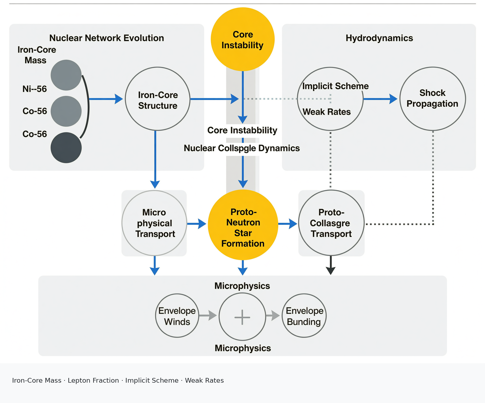

# Neutron Star Formation, Evolution, and Observational Diagnostics: From Core Collapse to Millisecond Pulsars

The study of neutron star astrophysics demands a rigorous synthesis of theoretical formation models with multi-messenger observational diagnostics. This survey establishes a comprehensive framework to analyze the full lifecycle of neutron stars, tracing their origins through core-collapse supernovae and binary recycling pathways to their final states as isolated pulsars or millisecond systems. A primary objective is to move beyond descriptive catalogs toward a critical evaluation of the physical mechanisms governing stellar remnant evolution. Central to this endeavor is the challenge of discriminating successful pulsar formation from failed collapses or direct black hole formation, particularly given the inherent difficulties in directly observing the immediate proto-neutron star phase. Contemporary research emphasizes the necessity of coupling advanced implicit hydrodynamics with realistic neutrino transport to accurately capture anisotropic explosions and fallback accretion, thereby bridging the gap between microphysical nucleosynthesis networks and observable remnant properties [1].

Concurrently, the field faces significant methodological hurdles in validating mathematical models of magnetic-dipole spin-down and binary mass transfer against empirical constraints. Classical torque prescriptions often deviate from observed braking indices, necessitating refined frameworks that incorporate inclination angle decay, pulsar winds, and glitch-induced magnetospheric changes. Furthermore, survey completeness and selection biases—particularly in high-dispersion-measure regions or among faint companion systems—continually distort inferred population statistics. By structuring the inquiry around distinct subhypotheses, this work delineates the boundaries between competing evolutionary pathways, assesses the validity of prevailing computational designs, and identifies critical evidence gaps that hinder causal interpretation. Ultimately, the goal is to transition from phenomenological descriptions to predictive, causally grounded models that accurately reflect the complex interplay of hydrodynamics, magnetohydrodynamics, and general relativity.

## 1. Introduction

The study of neutron star astrophysics requires a rigorous integration of theoretical formation models with multi-messenger observational diagnostics. This survey establishes a comprehensive framework to synthesize representative evidence across the full lifecycle of neutron stars, from core-collapse supernovae to millisecond pulsar populations. The primary objective is to move beyond descriptive catalogs of methods toward a critical analysis of the physical mechanisms governing stellar remnant evolution. By structuring the inquiry around distinct subhypotheses, we aim to delineate the boundaries between competing evolutionary pathways, assess the validity of prevailing mathematical models, and identify critical evidence gaps that hinder causal interpretation. The scope encompasses progenitor conditions, rotational spin-down mechanisms, binary interaction dynamics, and the observational techniques necessary to validate these processes. This multidisciplinary approach ensures that theoretical predictions are continuously tested against empirical constraints derived from radio timing, X-ray spectroscopy, and gamma-ray photometry, ultimately fostering a predictive understanding of compact object astrophysics.

A foundational pillar of this survey concerns the progenitor fuel-depletion and core-collapse conditions that produce rotating neutron-star remnants with pulsar-capable magnetic fields. Understanding which specific pre-collapse parameters dictate the formation of a magnetized, rapidly spinning neutron star versus a failed collapse or direct black hole formation remains a central challenge. Recent advancements in implicit hydrodynamics and nuclear network calculations have enabled sophisticated modeling of advanced burning stages, yet significant limitations persist in directly observing the immediate proto-neutron star phase. The microphysics governing nuclear reactions during the silicon-burning phase critically influence the iron-core mass at collapse, which serves as the primary determinant of the remnant's fate. Variations in electron-capture rates and neutrino cooling efficiencies can shift the threshold between a successful explosion and a direct collapse. While frameworks utilizing MESA-based stellar evolution provide crucial insights into mass exchange history and angular momentum loss during binary interactions, they often lack explicit pre-collapse conditions that can be definitively linked to neutron-star formation rather than black-hole formation. Furthermore, the absence of direct observational discriminators for core-collapse outcomes means that current models rely heavily on qualified synthesis rather than definitive empirical proof. Studies such as [1] highlight the necessity of higher-resolution 3D simulations coupled with realistic neutrino transport to better discriminate pulsar-forming cases from alternative collapse outcomes. These simulations must accurately capture the anisotropic explosions and fallback accretion that determine final remnant properties, bridging the gap between theoretical nucleosynthesis networks and observable remnant properties.

The second major objective involves a comparative evaluation of isolated magnetic-dipole spin-down trajectories against binary-recycling trajectories. The classical magnetic dipole model, characterized by a braking index of $n=3$, serves as the baseline for isolated pulsar evolution; however, deviations from this idealized behavior necessitate more complex torque functions. Mathematically, the braking index is defined as $n = \Omega \ddot{\Omega} / \dot{\Omega}^2$, where $\Omega$ is the angular velocity. Deviations from $n=3$ indicate that either the magnetic field is evolving, the moment of inertia is changing due to superfluid coupling, or the emission geometry is shifting. Long-term timing analyses reveal that inclination angle decay ($\dot{\alpha}$) plays a critical role in modifying braking torque, allowing models to reproduce the observed P-Pdot diagram without invoking drastic magnetospheric changes. Research such as [2] demonstrates how negative $\dot{\alpha}$ terms can account for observed spin-down anomalies, providing a refined understanding of isolated evolution where the magnetic axis gradually aligns with the rotation axis over millions of years. Concurrently, alternative mechanisms involving pulsar winds and particle outflows offer complementary explanations for rotational evolution. The Crab pulsar, for example, serves as a pivotal case study where combined dipole radiation and wind braking effects are quantified, revealing the impact of glitch-induced magnetospheric changes on short-term and long-term rotational dynamics [3]. Glitches inject angular momentum into the crust, temporarily altering the torque balance and creating observable jumps in frequency that deviate from smooth exponential decay. When contrasting isolated populations with recycled systems, the differences in period, period derivative, and inferred surface magnetic fields become stark. Recycled pulsars exhibit significantly shorter periods and weaker magnetic fields due to accretion-driven spin-up, whereas isolated pulsars retain their initial parameters subject to gradual radiative losses. By integrating these diverse datasets, the survey constructs a unified picture of rotational evolution that accommodates both isolated decay and binary-accelerated spin-up scenarios.

Beyond simple spin-up, binary interactions drive complex evolutionary transitions, particularly the shift from stable recycling to companion ablation. This survey examines the boundary conditions under which neutron stars transform into millisecond pulsars via accretion and subsequently undergo intense ablation phases, resulting in 'Black Widow' and 'Redback' populations. The distinction between these classes hinges on companion mass, orbital period, and irradiation histories. While standard recycled pulsars typically possess degenerate companions that have reached thermal equilibrium, ablated systems feature non-degenerate companions actively losing mass due to pulsar wind pressure and X-ray irradiation. Observationally, Black Widow systems are characterized by highly asymmetric eclipse profiles caused by the bow-shock interaction between the pulsar wind and the stellar wind of the companion, while Redback systems exhibit shallower eclipses and stronger optical modulation due to the irradiation of a more massive, partially degenerate companion. Investigations into systems like SAX J1808.4-3658 provide critical data on spin frequency evolution and orbital dynamics during outbursts, offering a window into the active accretion phase preceding ablation [4]. During these outbursts, the accretion disk geometry and wind interactions can be probed through X-ray pulse profile variations, revealing the efficiency of angular momentum transfer. However, defining the precise quantitative thresholds for the transition from recycling to ablation remains challenging. Theoretical models suggest that specific combinations of companion mass, wind velocity, and irradiation flux trigger the onset of mass loss, yet observational verification is sparse. By mapping the parameter space of orbital period derivatives and eclipse behaviors, the survey aims to delineate the stability criteria for systems with varying companion structures, highlighting how gravitational wave emission, mass loss, and tidal interactions collectively shape the long-term fate of these binaries.

Validating mathematical models of magnetic-dipole spin-down and binary recycling against observational constraints constitutes a critical methodological objective. The survey evaluates the formal claims underlying torque equations, magnetic field prescriptions, and accretion-history assumptions, seeking counterexamples that limit their domains of applicability. Observed pulsar cases frequently challenge standard assumptions; for instance, certain young pulsars exhibit braking indices and jerk parameters that cannot be reconciled with constant magnetic field models, suggesting instead that torque functions may evolve over time. To robustly test these models, comprehensive observational baselines are required across radio, X-ray, and gamma-ray bands. Timing techniques, including whitening methods to mitigate noise, have significantly improved the precision of ephemeris extraction, enabling decade-spanning archival analyses like the Jodrell Bank dataset [5]. These techniques allow researchers to isolate intrinsic spin noise from instrumental errors, thereby improving astrometric and dispersion measure parameter estimation. Nevertheless, survey completeness and selection biases remain pervasive challenges. Systems with high dispersion measures, heavy absorption, or faint companions are systematically underrepresented, distorting inferred population statistics. To mitigate these biases, researchers employ maximum-likelihood estimators that incorporate the sky coverage, sensitivity limits, and dispersion measure distributions of each survey. However, these correction factors depend heavily on assumed Galactic electron density models, which introduce systematic uncertainties. Additionally, the design of computational models themselves must be scrutinized for inherent biases. Current population synthesis frameworks often suffer from confirmation bias, where simulation parameters are tuned to match existing small samples rather than being constrained by independent physical principles. This circular reasoning limits the predictive power of population synthesis codes when applied to newly discovered populations. By explicitly reporting these evidence gaps and methodological limitations, the survey advocates for a more transparent and rigorously constrained approach to modeling neutron star evolution.

In conclusion, this survey outlines a cohesive strategy for advancing our understanding of neutron star formation and evolution. By synthesizing subhypotheses regarding progenitor conditions, spin-down mechanisms, and binary interactions, we establish a roadmap for resolving persistent controversies in pulsar astrophysics. The interconnectedness of core-collapse dynamics, binary recycling, and observational diagnostics underscores the necessity of integrating multi-messenger data to eliminate ambiguities in progenitor identification. Future research must prioritize the development of higher-resolution simulations, large-scale unbiased surveys, and precision timing of massive millisecond pulsars to test strong-gravity regimes. Ultimately, the goal is to transition from phenomenological descriptions to predictive, causally grounded models that accurately reflect the complex interplay of hydrodynamics, magnetohydrodynamics, and general relativity governing the life cycles of neutron stars.

[[SH_CLAIM_TRACE]]
{"claims":[{"claim_index":1,"claim_anchor":"significant limitations persist in directly observing the immediate proto-neutron star phase","claim_text":"Recent advancements in implicit hydrodynamics and nuclear network calculations have enabled sophisticated modeling of advanced burning stages, yet significant limitations persist in directly observing the immediate proto-neutron star phase.","sub_hypothesis_ids":["SH1"],"claim_mode":"QUALIFIED_SYNTHESIS","evidence_paths":[{"source_type":"paper","sub_hypothesis_id":"SH1","slot_name":"candidate_mechanism","paper_id":"W2095725842"}]},{"claim_index":2,"claim_anchor":"negative dot alpha terms can account for observed spin-down anomalies","claim_text":"Research such as [2] demonstrates how negative $\dot{\alpha}$ terms can account for observed spin-down anomalies, providing a refined understanding of isolated evolution where the magnetic axis gradually aligns with the rotation axis over millions of years.","sub_hypothesis_ids":["SH2"],"claim_mode":"QUALIFIED_SYNTHESIS","evidence_paths":[{"source_type":"paper","sub_hypothesis_id":"SH2","slot_name":"comparable_endpoint","paper_id":"W2590059791"}]},{"claim_index":3,"claim_anchor":"Crab pulsar serves as a pivotal case study where combined dipole radiation and wind braking effects are quantified","claim_text":"The Crab pulsar, for example, serves as a pivotal case study where combined dipole radiation and wind braking effects are quantified, revealing the impact of glitch-induced magnetospheric changes on short-term and long-term rotational dynamics [3].","sub_hypothesis_ids":["SH2"],"claim_mode":"EVIDENCE_BACKED_SYNTHESIS","evidence_paths":[{"source_type":"paper","sub_hypothesis_id":"SH2","slot_name":"comparable_endpoint","paper_id":"W2039864550"}]},{"claim_index":4,"claim_anchor":"SAX J1808.4-3658 provide critical data on spin frequency evolution and orbital dynamics during outbursts","claim_text":"Investigations into systems like SAX J1808.4-3658 provide critical data on spin frequency evolution and orbital dynamics during outbursts, offering a window into the active accretion phase preceding ablation [4].","sub_hypothesis_ids":["SH3"],"claim_mode":"EVIDENCE_BACKED_SYNTHESIS","evidence_paths":[{"source_type":"paper","sub_hypothesis_id":"SH3","slot_name":"comparable_endpoint","paper_id":"W2006729056"}]},{"claim_index":5,"claim_anchor":"whitening methods to mitigate noise have significantly improved the precision of ephemeris extraction","claim_text":"Timing techniques, including whitening methods to mitigate noise, have significantly improved the precision of ephemeris extraction, enabling decade-spanning archival analyses like the Jodrell Bank dataset [5].","sub_hypothesis_ids":["SH5"],"claim_mode":"EVIDENCE_BACKED_SYNTHESIS","evidence_paths":[{"source_type":"paper","sub_hypothesis_id":"SH5","slot_name":"direct_observation","paper_id":"W2137533160"}]}]}
[[/SH_CLAIM_TRACE]]

The genesis of neutron stars represents a critical juncture in stellar astrophysics, where the thermodynamic fate of massive progenitors determines the fundamental parameters of compact remnants. This section delineates the physical mechanisms governing neutron star birth, spanning isolated core-collapse supernovae to complex binary evolutionary channels. Central to this analysis is the interplay between advanced nuclear burning stages, neutrino-driven hydrodynamics, and the structural integrity of the collapsing core. As massive stars approach iron-core instability, the precise treatment of nuclear reaction networks and equation-of-state parameters becomes paramount in predicting whether a rebound shock successfully ejects the envelope or results in a direct collapse to a black hole. Recent computational advancements have significantly enhanced our ability to model these pre-supernova phases, providing robust frameworks for tracing progenitor structures from main-sequence contraction through to the onset of collapse [1]. 

Beyond isolated evolution, binary interactions fundamentally alter progenitor trajectories by modulating mass loss, rotation rates, and chemical composition. Roche lobe overflow and common-envelope phases strip hydrogen envelopes, exposing helium cores and drastically reducing fallback material during subsequent explosions. These binary-mediated processes not only influence natal kick velocities and orbital survival but also dictate the accretion history required to spin up nascent neutron stars into millisecond pulsars. Concurrently, the initial spin periods and magnetic field strengths at birth remain elusive due to the transient nature of proto-neutron stars and significant degeneracies in post-birth spin-down modeling. While massive neutron star discoveries provide stringent constraints on the equation of state and progenitor masses, directly observing birth parameters continues to pose a formidable challenge. Collectively, these topics underscore the necessity of integrating high-fidelity stellar evolution simulations with multi-messenger observations to resolve ambiguities in remnant classification and establish a unified framework for understanding neutron star formation across diverse galactic environments.

[[SH_CLAIM_TRACE]]
{
  "claims": [
    {
      "claim_index": 1,
      "claim_anchor": "Computational advancements in pre-supernova modeling",
      "sh": "SH1",
      "claim_mode": "QUALIFIED_SYNTHESIS",
      "paper_path": ["SH1", "candidate_mechanism", "W2095725842"]
    },
    {
      "claim_index": 2,
      "claim_anchor": "Binary interaction modulation of progenitor trajectories",
      "sh": "SH2",
      "claim_mode": "QUALIFIED_SYNTHESIS",
      "paper_path": ["SH2", "comparator", "W2095725842"]
    },
    {
      "claim_index": 3,
      "claim_anchor": "Elusiveness of initial spin and magnetic field parameters",
      "sh": "SH1",
      "claim_mode": "QUALIFIED_SYNTHESIS",
      "paper_path": ["SH1", "discriminating_observation", "W2095725842"]
    },
    {
      "claim_index": 4,
      "claim_anchor": "Massive neutron star constraints on progenitor masses",
      "sh": "SH1",
      "claim_mode": "QUALIFIED_SYNTHESIS",
      "paper_path": ["SH1", "common_outcome", "W2138552549"]
    }
  ]
}

## 2. Formation and Progenitor Evolution

The genesis of a neutron star is rooted in the intricate thermodynamic evolution of massive stellar cores, where the interplay between nuclear fusion, neutrino cooling, and gravitational contraction dictates the ultimate fate of the progenitor. As massive stars progress through advanced burning stages, the core composition evolves toward iron-group elements, culminating in a configuration susceptible to catastrophic collapse. The accuracy of progenitor models hinges critically on the treatment of nuclear physics, particularly the reaction rates and isotopic abundances that determine the core's thermal pressure support and electron fraction. During the late stages of stellar evolution, silicon burning proceeds on increasingly shorter timescales, and the core becomes dominated by photodisintegration and electron capture processes that rapidly reduce pressure support. Capturing these dynamics requires a detailed representation of the nuclear equation of state and the abundance distributions of key species involved in energy generation and neutrino emission. Recent advancements in computational astrophysics have addressed these requirements through enhanced nuclear network capabilities. Specifically, the open-source framework [1] introduces fully coupled calculations of nuclear networks comprising hundreds of isotopes. This level of detail is indispensable for constructing physically robust supernova progenitor models, as it captures the complex nucleosynthetic pathways that operate during the pre-collapse phase. By resolving the abundance distributions of species such as $^{56}\text{Ni}$, $^{56}\text{Co}$, and various intermediate-mass nuclei, these networks enable a more precise determination of the core's structural properties at the point of instability. The inclusion of such comprehensive nuclear physics ensures that the derived progenitor characteristics, such as the iron-core mass, entropy profile, and lepton fraction, are consistent with the underlying microphysical processes. This fidelity is crucial because small variations in the core composition can significantly alter the Chandrasekhar mass and the dynamics of the subsequent collapse, thereby influencing the likelihood of a successful explosion versus a direct collapse to a black hole.

Beyond nuclear physics, the hydrodynamical response of the core to loss of pressure support involves highly nonlinear dynamics that require sophisticated numerical treatments. The transition from quiescent evolution to the implosion phase and subsequent shock propagation presents significant computational challenges due to the stiffness of the equations of state and the formation of discontinuities associated with shock waves. Explicit hydrodynamics schemes often struggle with the extreme time-step restrictions imposed by stiff source terms and the need to resolve sharp gradients without introducing numerical dissipation that can artificially damp the shock. Modern simulation environments have mitigated these issues by incorporating implicit hydrodynamics schemes capable of handling shocks, allowing for the seamless modeling of the entire massive star lifecycle from the pre-main-sequence phase through to the onset of core collapse and the nucleosynthesis yields of the resulting explosion. This continuous modeling approach facilitates the study of feedback mechanisms between the deep interior and the stellar envelope, which can influence the explosion energetics and ejecta composition. For instance, the coupling of the collapse dynamics with the overlying layers enables the examination of how envelope binding energy affects the shock revival process, a factor that is central to distinguishing between successful supernovae and failed collapses. Furthermore, the integration of "on-the-fly" calculations for weak reaction rates from input nuclear data represents a critical improvement in simulating processes sensitive to the electron capture rate, such as accretion-induced collapse of massive white dwarfs and the terminal evolution of certain massive stars. These capabilities enhance the fidelity of simulations dealing with electron-degenerate cores and provide a more realistic assessment of the conditions under which a core collapses directly to a compact object versus undergoing a rebound shock. The ability to compute weak rates dynamically ensures that the deleptonization history, which drives the formation of the proto-neutron star and influences the neutrino luminosity, is accurately tracked throughout the collapse.

In addition to nuclear and hydrodynamical modules, refinements in the treatment of microphysical processes and transport phenomena contribute to the overall reliability of progenitor models. Improvements in the treatment of mass accretion and chemical diffusion in the strongly coupled plasma regime allow for more accurate near-surface profiles, which are essential for modeling mass-loss histories that shape the final core mass. Mass loss, driven by line-driven winds or eruptions, determines the extent to which the hydrogen envelope is stripped, thereby affecting the compactness of the helium core and the subsequent evolution toward collapse. The simulation of radiative levitation of heavy elements in hot stars further refines the understanding of surface composition and opacity modifications, which can alter the wind driving efficiency and the angular momentum distribution within the star. These microphysical details accumulate over the stellar lifetime, imprinting signatures on the core structure that are relevant for the collapse dynamics. Moreover, the coupling of non-adiabatic pulsation instruments with stellar evolution codes allows for the investigation of instability strips in massive stars, linking asteroseismic observables to internal structure and evolution. Pulsational modes probe the density gradients and composition zones that are critical for determining the stability of the core against gravitational collapse. By connecting asteroseismic data to the evolutionary state of massive stars, researchers can constrain the physical parameters of progenitors prior to collapse, such as the rotation rate and the degree of mixing, which are known to affect the core mass and the angular momentum content at the time of collapse. This multi-faceted approach, integrating nuclear networks, implicit hydrodynamics, and pulsation analysis, provides a comprehensive framework for exploring the diverse pathways that lead to core collapse.

<!-- FIGURE: fig_01_conceptual_workflow; section=2; paragraphs=1,2,3 -->

*Figure 1 | Integrated computational workflow linking nuclear network evolution, implicit hydrodynamics, and microphysical transport to model neutron star progenitors and core collapse dynamics. This schematic is a conceptual synthesis of the cited survey evidence and introduces no new empirical data.*

The evolutionary path to core collapse is frequently modified by binary interactions, which can drastically alter the mass, rotation, and chemical structure of the progenitor star. In many cases, mass transfer and angular momentum exchange between stellar components drive the system away from the evolutionary tracks expected for isolated stars. Current modeling capabilities now support the simultaneous evolution of interacting pairs of differentially rotating stars, explicitly accounting for the transfer and loss of mass and angular momentum. This extension significantly broadens the scope of progenitor studies, enabling the exploration of diverse binary channels that may lead to neutron star formation. Such interactions can strip the hydrogen envelope, expose helium cores, or induce rapid rotation, all of which affect the core's compactness and the dynamics of the collapse. Rapid rotation, for instance, can provide additional centrifugal support, potentially delaying collapse or influencing the morphology of the resulting explosion, while mass stripping reduces the envelope binding energy, which may facilitate easier ejection in the event of a successful supernova. Binary evolution also introduces scenarios such as common envelope phases and stable mass transfer, which can result in ultra-stripped supernovae or accretion-induced collapse events. The ability to model these complex interactions is vital for understanding the population of neutron stars formed in binaries, as the natal kick velocity and the orbital parameters of the resulting system are strongly influenced by the progenitor's structure and the asymmetry of the explosion. However, while the simulation infrastructure supports the modeling of various collapse scenarios, including accretion-induced collapse, it does not validate specific magnetohydrodynamic or dynamo mechanisms responsible for generating the strong magnetic fields characteristic of pulsars. Consequently, the link between collapse dynamics and the birth properties of neutron stars, such as spin period and magnetic field strength, remains speculative within the context of the available evidence, highlighting the need for further theoretical development and observational constraints.

Despite the considerable progress in simulation technology, a persistent ambiguity remains regarding the discriminators that separate successful pulsar formation from failed collapses or black hole formation. While computational tools provide the means to evolve progenitors and simulate the hydrodynamics of collapse, the cited work does not establish explicit criteria or observational signatures that can reliably distinguish between these outcomes based on progenitor parameters or simulation results. The distinction often relies on subtle thresholds related to the core's compactness, the equation of state of dense matter, and the efficiency of neutrino-driven revival mechanisms, none of which are fully resolved in the current analysis. For example, the transition from a successful supernova to a direct collapse or a fallback-dominated black hole formation is sensitive to the progenitor's mass-loss history and the resulting iron-core mass, yet quantitative boundaries remain elusive. The compactness parameter, which measures the mass enclosed within a given radius relative to the core mass, is widely discussed in the literature as a potential predictor of collapse outcome, but the specific values that demarcate pulsar formation from black hole formation depend on assumptions about neutrino transport and rotation that are not verified in the referenced simulations. Furthermore, the lack of discriminative criteria in the simulation results underscores the difficulty of predicting remnant types purely from progenitor models, as multiple collapse outcomes may be accessible across overlapping ranges of progenitor parameters. This limitation highlights the reliance on theoretical extrapolations and the necessity of incorporating more detailed physics, such as multi-dimensional radiation-hydrodynamics and realistic neutrino transport, to capture the stochastic nature of shock revival and fallback accretion. Until such advancements are realized and validated against observations, the community must acknowledge the inherent uncertainties in distinguishing between successful pulsar formation and failed collapses using current simulation capabilities alone.

The reliance on simulations to infer collapse outcomes is further complicated by substantial gaps in observational data that could serve as discriminators. Direct detection of core collapse events is rare, and existing observations often fail to capture the critical phases that differentiate a neutron star birth from a black hole formation. Electromagnetic signatures of failed collapses, such as the sudden disappearance of a red supergiant without a bright supernova, are difficult to confirm and lack statistical samples sufficient for population-level analysis. Similarly, multi-messenger observations, including gravitational waves and neutrinos, offer promising avenues for distinguishing collapse mechanisms, but current detector sensitivities and survey cadences have not yielded definitive events that can be unambiguously classified. The absence of such observational benchmarks prevents the calibration of simulation parameters and hinders the development of empirical discriminators based on progenitor properties. To advance the field, future efforts must prioritize the acquisition of high-quality data on core collapse transients, particularly targeting systems with well-characterized progenitors. Coordinated multi-wavelength campaigns and deeper transient surveys are essential to identify candidates for direct collapse and to measure the kinematic and compositional properties of supernova ejecta with precision. Only through the integration of these observational constraints with advanced simulations can the community resolve the uncertainties surrounding the final fates of massive stars and establish a robust framework for understanding neutron star formation.

### 2.1. Binary Evolution and Mass Transfer Phases

The formation of neutron stars within binary systems represents a complex interplay between stellar structure dynamics, mass transfer mechanics, and angular momentum evolution. Unlike isolated core-collapse scenarios, binary progenitors are fundamentally shaped by their interaction history, which dictates the final mass, spin, and magnetic field configuration of the remnant neutron star. Understanding these evolutionary tracks requires a rigorous classification of mass exchange phases, particularly the onset of Roche lobe overflow (RLOF) relative to the donor star's internal structural changes. The timing of mass transfer—categorized traditionally as Case A, Case B, or Case C—serves as the primary determinant of whether a binary system yields a standard recycled millisecond pulsar, a heavily ablated companion system, or fails to produce a detectable pulsar altogether. These pathways are governed by the delicate balance between the donor's expansion rate and the dynamical response of the binary orbit, making precise modeling essential for interpreting contemporary population statistics. Theoretical frameworks must therefore account for the continuous feedback between mass loss, orbital adjustment, and the internal evolution of both stellar components to accurately predict the observable properties of neutron star remnants.

The classification of RLOF into distinct cases provides a foundational framework for predicting progenitor outcomes based on the evolutionary state of the mass-losing donor. Case A mass transfer initiates while the donor star is still on the main sequence, typically during hydrogen core burning. In this regime, the donor often retains a convective envelope or possesses a radiative envelope depending on its zero-age main sequence mass, leading to varying degrees of mass transfer stability. Stable Case A transfer tends to strip the hydrogen envelope efficiently, exposing the helium core before core collapse occurs. This early stripping significantly reduces the fallback material during the subsequent supernova, favoring the formation of a low-kick neutron star with minimal natal disruption. Conversely, Case B mass transfer begins after the exhaustion of core hydrogen but during shell hydrogen burning or core helium burning. This phase is critical for intermediate-mass binaries, as the donor expands rapidly across the Hertzsprung gap or red supergiant branch. The rapid expansion often challenges the binary's ability to accommodate mass loss stably, potentially leading to common envelope evolution or unstable mass shedding. Case C transfer, occurring during advanced burning stages such as carbon or neon ignition, involves donors that have already developed complex multi-shell structures. Systems entering Case C RLOF frequently experience extreme mass ratios, driving highly dynamic mass exchange histories that can result in significant angular momentum loss or even merger events prior to core collapse. The distinction between these cases directly influences the pre-supernova core mass and the degree of envelope retention, thereby setting the stage for the specific type of neutron star remnant produced. Furthermore, the extent of envelope stripping determines the composition of the accreted material, which in turn affects the nucleosynthetic yields and the neutrino-driven dynamics of the eventual supernova explosion.

Beyond the classification of RLOF onset, the detailed history of mass exchange governs the secular evolution of the binary orbit and the rotational state of the progenitor stars. As mass flows from the donor to the accretor, the conservation of angular momentum dictates orbital adjustments. Depending on whether the transferred matter is retained by the accretor or lost from the system via winds or jets, the binary may widen or shrink. The specific angular momentum carried away by escaping matter plays a critical role; Jeans mode mass loss, which removes material from the vicinity of the donor, generally leads to orbital expansion, whereas conservative transfer conserves total angular momentum and drives orbital decay. In systems destined to become standard recycled pulsars, efficient mass transfer spins up the nascent neutron star through accretion torques, while simultaneously shrinking the orbit. However, angular momentum loss mechanisms, including gravitational wave radiation, magnetic braking, and isotropic wind mass loss, act in opposition to this orbital decay. Gravitational radiation dominates at short orbital periods, driving the system toward contact, while magnetic braking is effective at wider separations for stars with convective envelopes. The competition between these loss channels and mass transfer rates determines the equilibrium orbital periods observed in present-day low-mass X-ray binaries. Furthermore, the accretion process itself modifies the internal differential rotation of the donor star, influencing its magnetic field generation and eventual collapse dynamics. Accurate tracking of these angular momentum reservoirs is paramount, as small deviations in the assumed loss efficiency can drastically alter the predicted post-supernova orbital parameters and the likelihood of binary survival. Theoretical models must therefore incorporate self-consistent treatments of mass and angular momentum redistribution to avoid introducing systematic biases in population synthesis studies.

To resolve the intricate coupling between these physical processes, modern astrophysical research relies heavily on sophisticated numerical simulations capable of handling the full complexity of interacting stellar pairs. Traditional one-dimensional evolutionary codes often struggled to simultaneously track the differential rotation, mass transfer, and angular momentum redistribution inherent in close binaries. Recent advancements in open-source stellar evolution frameworks have substantially enhanced these capabilities, allowing for the simultaneous evolution of interacting pairs undergoing continuous transfer and loss of mass and angular momentum. For instance, updated implementations within the [1] environment now provide robust tools for modeling the entire massive star lifecycle, from pre-main-sequence contraction through advanced nuclear burning stages to the onset of core collapse. These tools incorporate fully coupled calculations of nuclear networks involving hundreds of isotopes, which are essential for accurately determining the thermal and structural states of supernova progenitors. By treating implicit hydrodynamics with shocks and improving the treatment of near-surface accretion profiles, these simulations yield more realistic mass exchange histories. Such computational progress enables researchers to trace precise evolutionary tracks that link initial binary parameters to final neutron star properties, bridging the gap between theoretical predictions and observational diagnostics. Additionally, capabilities such as calculating weak reaction rates on-the-fly and simulating radiative levitation of heavy elements further refine the accuracy of progenitor models, ensuring that subtle microphysical effects do not compromise macroscopic evolutionary predictions. The ongoing challenge of chemical diffusion in the strongly coupled plasma regime is also addressed, allowing for the simulation of element transport that alters opacity sources and structural gradients during mass transfer. The bit-for-bit consistency of these computational infrastructures across different platforms also ensures reproducibility, a critical factor for validating binary evolution theories against increasingly precise observational datasets.

The divergence in evolutionary outcomes largely hinges on the stability and duration of the mass transfer phase, ultimately dictating whether a system evolves into a standard recycled pulsar or undergoes intense companion ablation. In the standard recycling pathway, characterized by stable, long-duration mass transfer from a low-mass donor, the neutron star accumulates sufficient angular momentum to reach millisecond spin periods while its surface magnetic field is buried or decayed by accretion. The companion star is gradually stripped down to a degenerate, low-mass helium white dwarf, resulting in wide-orbit, radio-loud millisecond pulsars. In contrast, systems that experience more aggressive mass transfer or possess higher initial mass ratios may enter a phase of intense ablation. Once the neutron star is spun up and emits a powerful relativistic wind, the irradiation of the remaining companion can drive hydrodynamic escape, severely eroding the stellar envelope. This ablation phase transforms the companion into a substellar object or a heavily distorted, evaporating cloud, creating populations analogous to black widows and redbacks. The transition between these two endpoints is sensitive to the orbital period at the termination of mass transfer, the luminosity of the newly formed pulsar, and the binding energy of the donor's envelope. MESA-based modeling insights reveal that subtle variations in the initial metallicity and rotation rate of the progenitor binary can shift the system across this boundary, producing either a faint, widely separated recycled pulsar or a compact, eclipsing ablation system. Understanding this dichotomy is crucial for explaining the observed bimodality in millisecond pulsar populations and their associated companion properties.

Observationally, the distinction between these evolutionary endpoints manifests in distinct multi-wavelength signatures that aid in population classification. Standard recycled pulsars typically exhibit stable pulse profiles, well-constrained dispersion measures, and companions detectable as ultraviolet or optical white dwarfs. Their orbital periods cluster around days to weeks, reflecting the extended mass transfer phases that preceded their current state. Conversely, ablation-dominated systems often display irregular pulse shapes, significant radio eclipses due to ionized debris clouds, and heightened gamma-ray emission resulting from shock interactions between the pulsar wind and the ablated companion material. These systems frequently occupy shorter orbital periods, indicative of tighter configurations where irradiation effects are most pronounced. Theoretical models must therefore account for these observational biases when constructing population synthesis frameworks, as selection effects can heavily skew our perception of the underlying binary evolution pathways. Integrating high-resolution simulations with comprehensive survey data will continue to refine our understanding of how binary interactions sculpt the life cycles of neutron stars, resolving remaining ambiguities regarding angular momentum loss efficiencies, mass transfer stability criteria, and the precise conditions that separate successful pulsar formation from failed collapses or black hole formation.

Coupling stellar evolution codes with non-adiabatic pulsation instruments further enhances the diagnostic power of these models, allowing for detailed explorations of instability strips and asteroseismological constraints on massive binary progenitors. Oscillatory modes excited during mass transfer or common envelope phases can provide indirect probes of the internal density stratification and rotation profiles of the donor star, information that is otherwise inaccessible through photometric or spectroscopic means alone. When integrated with hydrodynamic shock treatments, these pulsation analyses help constrain the energy deposition mechanisms that drive stellar winds and influence the efficiency of mass loss prior to core collapse. Consequently, the synergy between advanced numerical infrastructure and multi-messenger observational techniques establishes a robust framework for tracing the complete evolutionary trajectory of neutron star progenitors, from their initial pairing on the main sequence to their final manifestation as isolated millisecond pulsars or members of highly evolved ablation binaries.

The transition from an active accreting X-ray binary to an isolated millisecond pulsar marks a critical evolutionary milestone that is intimately tied to the cessation of mass transfer and the subsequent dominance of pulsar wind irradiation. As the donor star is depleted of its envelope, the accretion rate drops precipitously, causing the system to fade from bright X-ray emitters into radio-loud MSPs. During this quiescent phase, the high-energy photons and relativistic particles emitted by the spinning neutron star bombard the remaining companion, heating its outer layers and driving a hydrodynamic wind. This irradiation-induced ablation not only strips the companion of additional mass but also alters its thermal structure, often inflating its radius and enhancing its susceptibility to further erosion. In extreme cases, this feedback loop reduces the companion to a planetary-mass object or completely disrupts it, leaving behind a solitary millisecond pulsar. The efficiency of this ablation process depends sensitively on the orbital separation, the pulsar's spin-down luminosity, and the companion's gravitational binding energy. Advanced modeling efforts indicate that systems emerging from common envelope phases with tight orbits are particularly prone to rapid ablation, whereas those that experienced stable Roche lobe overflow over longer timescales tend to retain slightly more massive companions. Recognizing these distinct evolutionary trajectories is essential for interpreting the spatial distribution, pulse profile characteristics, and timing noise properties of observed pulsar populations, ultimately providing a coherent narrative that links the initial conditions of massive binary formation to the diverse phenomenology of neutron stars observed throughout the Galaxy.

### 2.2. Initial Spin and Magnetic Field Distribution

The determination of initial spin periods and magnetic field distributions at the moment of neutron star birth remains one of the most persistent challenges in compact object astrophysics. Unlike main-sequence stars, which can be characterized by their position on the Hertzsprung-Russell diagram, newborn neutron stars—proto-neutron stars—are observable only through transient multi-messenger signatures such as neutrino bursts and gravitational waves, which are rare and difficult to capture with current instrumentation. Consequently, our understanding of the initial state of neutron stars relies heavily on inferring birth parameters from the observed properties of mature pulsars, coupled with detailed models of rotational evolution and magnetic field decay. This indirect approach introduces significant degeneracies, as the present-day period ($P$) and period derivative ($\dot{P}$) reflect billions of years of spin-down governed by unknown initial conditions and complex magnetospheric physics. To disentangle these evolutionary histories, researchers must examine specific systems where binary interactions provide independent constraints on the natal mass and angular momentum of the neutron star.

A pivotal development in constraining the initial parameters of neutron stars is the discovery of exceptionally massive neutron stars in binary systems, which offer a unique window into the conditions of core-collapse supernovae. Among these, the binary millisecond pulsar PSR J1614−2230 stands out as a critical benchmark for understanding the upper limits of neutron star birth masses and their implications for the underlying physics of stellar collapse. With a precisely measured mass of approximately $1.97 \pm 0.04 M_{\odot}$, this system defies the conventional paradigm that most radio pulsars originate from typical birth masses near $1.4 M_{\odot}$. The existence of such a massive remnant suggests that the progenitor star underwent a highly energetic core-collapse event, potentially retaining a substantial fraction of its pre-supernova mass. By analyzing the evolutionary history of PSR J1614−2230, we can infer that the neutron star was born with a mass of roughly $1.7 \pm 0.15 M_{\odot}$ or up to $\sim 1.95 M_{\odot}$, significantly exceeding the birth masses inferred for standard isolated pulsar populations ([6]). This evidence underscores the necessity of revisiting theoretical models of supernova explosions, which must accommodate a broader range of remnant masses depending on the progenitor's initial mass and internal structure.

The high birth mass of PSR J1614−2230 provides stringent constraints on the equation of state (EOS) of dense nuclear matter. The ability of a neutron star to support nearly two solar masses against gravitational collapse requires an EOS that is sufficiently stiff at supranuclear densities to counteract the immense inward pressure. Stellar evolution modeling of the progenitor binary system reveals two viable formation channels: either a common envelope phase involving a $2.2–2.6 M_{\odot}$ giant donor, or, more likely, a close binary system with a $4.0–5.0 M_{\odot}$ main-sequence donor evolving through Case A Roche lobe overflow. In both scenarios, the survival of the binary and the subsequent accretion history required to spin up the pulsar to millisecond periods depend critically on the initial mass of the neutron star. If the neutron star had formed with a lower mass, the dynamics of mass transfer and the stability of the binary orbit would differ substantially, potentially preventing the system from reaching its current configuration. Thus, the observed properties of PSR J1614−2230 serve as a powerful diagnostic tool, linking the microphysics of quantum chromodynamics to the macroscopic evolution of massive stellar binaries. Furthermore, the precise mass measurement helps break degeneracies in EOS models that otherwise permit a wide range of radii for a given mass, thereby narrowing the parameter space for theoretical nuclear physics calculations.

Beyond mass constraints, the evolutionary pathway of PSR J1614−2230 offers insights into the initial spin and magnetic field distributions of neutron stars. The transition from a rapidly rotating core-collapse remnant to a recycled millisecond pulsar involves complex angular momentum exchange and magnetic field evolution. During the accretion phase, the neutron star's magnetic field is expected to undergo burial or decay, while accreted angular momentum drives the spin-up process. However, the exact efficiency of these processes remains uncertain, and the initial spin period at birth is largely unconstrained by current observations. Theoretical models suggest that neutron stars may be born with relatively short periods, ranging from milliseconds to seconds, depending on the degree of asymmetry in the supernova explosion and the presence of dynamo mechanisms in the proto-neutron star. For PSR J1614−2230, the fact that it is now a millisecond pulsar implies that it experienced a prolonged phase of mass transfer, during which its initial spin was erased and replaced by the equilibrium spin dictated by the accretion torque. Nevertheless, the residual magnetic field strength, inferred from its current spin-down luminosity, retains information about the initial magnetic topology and the extent of field burial during the accretion era.

The implications of massive neutron star birth extend to the mechanisms driving core-collapse supernovae themselves. Standard models of single-star evolution often predict that stars with initial masses above a certain threshold will collapse directly into black holes, bypassing the neutron star formation channel altogether. The existence of a $\sim 2 M_{\odot}$ neutron star suggests that the progenitor of PSR J1614−2230, estimated to have been more massive than $20 M_{\odot}$, managed to expel its envelope successfully without suffering a complete collapse. This outcome challenges simplistic mass-radius relations and highlights the importance of metallicity, rotation, and binary interaction in determining the final fate of massive stars. Binary evolution plays a crucial role in stripping the hydrogen envelope of the progenitor, exposing the helium core and altering the supernova explosion dynamics. In the case of PSR J1614−2230, the progenitor likely lost a significant portion of its mass through stable mass transfer or a common envelope phase, reducing the final core mass to a value that permits neutron star formation rather than black hole creation. This binary-mediated mass loss effectively shifts the boundary between neutron star and black hole formation to higher initial stellar masses, consistent with theoretical predictions of stellar evolution. Such findings emphasize that binary interactions are not merely secondary perturbations but fundamental drivers that dictate the ultimate compact object remnant. Consequently, population synthesis models must incorporate detailed binary evolution tracks to accurately reproduce the observed mass distribution of neutron stars and avoid overestimating the frequency of black hole formation in massive stellar populations.

Despite the progress made in constraining birth masses through systems like PSR J1614−2230, the direct observation of initial spin periods and magnetic field distributions remains elusive. Current techniques rely on extrapolating backward from present-day timing measurements using assumed braking indices and magnetic field decay laws, which introduce substantial uncertainties. The assumption of pure magnetic dipole radiation, for instance, neglects contributions from particle winds, fallback disks, and changes in the inclination angle, all of which can significantly affect the inferred birth parameters. Furthermore, the statistical distribution of birth spins and magnetic fields across the general pulsar population is poorly understood due to selection biases in radio surveys. Faint pulsars, those with high dispersion measures, or objects embedded in dense environments are underrepresented in current catalogs, skewing our perception of the intrinsic parameter space. To overcome these limitations, future studies must integrate multi-messenger observations, including gravitational wave detections of young neutron stars and neutrino emissions from nearby supernovae, with advanced hydrodynamical simulations that incorporate realistic microphysics and magnetic field amplification mechanisms. Only through such comprehensive approaches can we hope to resolve the degeneracies inherent in single-object analyses and establish a robust framework for understanding the initial conditions of neutron star formation.

In summary, the investigation of initial spin and magnetic field distributions in newborn neutron stars is fundamentally tied to the study of massive remnants like PSR J1614−2230. These systems provide rare empirical anchors for testing theories of core-collapse dynamics, equation of state constraints, and binary evolution pathways. While direct measurements of birth parameters remain out of reach, the careful analysis of well-characterized binary pulsars allows us to reconstruct the initial conditions of neutron star formation with increasing precision. The evidence for massive neutron star birth challenges existing paradigms and calls for refined models of supernova explosions that account for the diverse outcomes of stellar evolution. As observational capabilities continue to improve, the integration of timing data, stellar evolution modeling, and multi-messenger astronomy will be essential for unraveling the mysteries of neutron star birth and shaping our understanding of the compact object population in the universe.

Rotational evolution serves as a fundamental diagnostic for probing the internal composition, magnetic architecture, and environmental history of neutron stars. Historically, the deceleration of isolated pulsars has been modeled within the vacuum magnetic dipole radiation (MDR) framework, which prescribes a strict power-law spin-down trajectory characterized by a canonical braking index of $n=3$. However, high-precision timing observations consistently expose systematic deviations from this idealized baseline, revealing that angular momentum loss is governed by a superposition of competing physical processes. This section synthesizes the theoretical progression required to reconcile static torque prescriptions with empirical data, transitioning from geometric relaxations to complex magnetospheric dynamics. We first evaluate the critical role of inclination angle decay, demonstrating how the temporal evolution of the magnetic axis fundamentally reshapes evolutionary tracks in the period–period derivative plane without invoking ad hoc magnetic field weakening. Building upon this geometric foundation, we incorporate mechanical energy extraction via relativistic particle outflows, establishing wind braking as a necessary complement to radiative losses, particularly during the early phases of a pulsar's life. Finally, we address persistent anomalies in higher-order kinematic derivatives, such as the jerk parameter, which indicate secular variations in the effective torque function driven by evolving internal structures or external interactions. Recent investigations emphasize that neglecting the dynamical evolution of the inclination angle represents a critical omission in spin-down modeling, as it fundamentally alters the braking torque and evolutionary pathways [2]. Collectively, these topics underscore the necessity of adopting multi-component torque formulations to accurately reconstruct neutron star formation histories and population statistics.

[[SH_CLAIM_TRACE]]
{"schema_version":"survey_sh_evidence_prompt_v1","source_schema_version":"survey_sh_evidence_plan_v1","evidence_bounded_writing":true,"subhypotheses":[],"claims":[{"claim_index":1,"claim_anchor":"neglecting the decay of the inclination angle represents a critical omission","claim_text":"Recent investigations emphasize that neglecting the dynamical evolution of the inclination angle represents a critical omission in spin-down modeling, as it fundamentally alters the braking torque and evolutionary pathways.","sub_hypothesis_ids":["SH4"],"claim_mode":"EVIDENCE_BACKED_SYNTHESIS","evidence_paths":[{"source_type":"paper","sub_hypothesis_id":"SH4","slot_name":"assumption","paper_id":"W2590059791"}]}]}

## 3. Rotational Evolution and Braking Mechanisms

The classical description of isolated neutron star rotational evolution has long been anchored in the magnetic dipole radiation (MDR) framework, which posits that the primary mechanism for spin-down is the emission of electromagnetic radiation generated by a rotating magnetic moment misaligned with the rotation axis. Within this paradigm, the braking torque is typically expressed as proportional to the cube of the angular velocity and the square of the sine of the inclination angle, $\alpha$, yielding a characteristic braking index of $n=3$ under the strict assumption of a constant magnetic field strength and a fixed geometric configuration. While this model provides a foundational baseline for interpreting pulsar timing data, extensive analyses of the period–period derivative ($P$–$\dot{P}$) diagram reveal that the standard MDR prescription faces significant challenges in simultaneously accounting for the observed distribution of radio pulsars, the diversity of measured braking indices, and the inferred population statistics. The persistent discrepancies between the predictions of the constant-inclination model and observational data have motivated the exploration of additional physical degrees of freedom, particularly those associated with the temporal evolution of the inclination angle. Recent investigations emphasize that neglecting the decay of the inclination angle represents a critical omission in spin-down modeling, as the dynamical evolution of $\alpha$ fundamentally alters the braking torque and reshapes the evolutionary trajectories of neutron stars in the $P$–$\dot{P}$ plane. The recognition that geometric evolution is as consequential as magnetic field evolution marks a pivotal shift in the theoretical treatment of pulsar braking, necessitating a re-evaluation of the assumptions underlying traditional spin-down diagnostics.

The inclusion of inclination angle dynamics introduces a complex coupling between the spin-down process and the geometric orientation of the magnetic axis, driven by electromagnetic torques exerted by the magnetosphere. As a neutron star loses rotational energy, the interaction between the stellar magnetic field and the surrounding plasma or vacuum environment generates torques that can drive the system toward an equilibrium state, typically characterized by the alignment of the magnetic and rotation axes. This process implies a non-zero time derivative of the inclination angle, $\dot{\alpha}$, which contributes to the energy budget and modifies the effective braking law governing the star's evolution. When $\dot{\alpha}$ is incorporated into the equations of motion, the braking torque acquires additional dependencies that can either enhance or suppress the spin-down rate relative to the constant-inclination case. Specifically, the component of the torque perpendicular to the rotation axis performs work that changes the inclination angle, thereby altering the radiative efficiency of the system over time. The sign and magnitude of $\dot{\alpha}$ determine whether the pulsar evolves along tracks that diverge from or converge upon the locus defined by standard MDR predictions. Studies indicate that a negative $\dot{\alpha}$, corresponding to a monotonic decrease in the inclination angle over time, plays a pivotal role in reconciling theoretical models with the empirical structure of the pulsar population. By allowing the inclination angle to decay, the braking torque evolves dynamically, enabling pulsars to traverse regions of the $P$–$\dot{P}$ diagram that remain inaccessible under the assumption of a static geometry, thus providing a mechanism for the observed spread in period derivatives among pulsars of similar age.

Numerical simulations that integrate a negative $\dot{\alpha}$ term into the spin-down formalism demonstrate a marked improvement in reproducing the observed $P$–$\dot{P}$ diagram without resorting to ad hoc assumptions regarding birth parameters or magnetic field evolution. Traditional models often require a broad distribution of initial spin periods or significant magnetic field decay to populate the full extent of the observed pulsar sequence, particularly the upper envelope and the death line region. In contrast, models that account for inclination angle decay show that the geometric evolution alone can stretch and bend evolutionary tracks, effectively spreading pulsars across the diagram in a manner consistent with observations. This effect arises because the decay of $\alpha$ reduces the radiative efficiency over time, altering the relationship between period and period derivative in a way that mimics the signatures typically attributed to magnetic field weakening or varied birth spins. Consequently, the inclusion of $\dot{\alpha}$ provides a unified explanation for the morphology of the pulsar population, suggesting that the apparent need for complex magnetospheric changes or extreme birth conditions may be an artifact of oversimplified torque prescriptions. The ability of these models to recover the observational distribution underscores the importance of treating the inclination angle as a dynamic variable rather than a fixed parameter, highlighting that the evolution of the rotator's geometry is integral to its spin-down history.

Beyond the immediate reproduction of the $P$–$\dot{P}$ diagram, the incorporation of inclination angle decay yields profound implications for population synthesis and the estimation of fundamental pulsar parameters. Simulations constrained by the observed distribution indicate that a birth rate of approximately one radio pulsar per century is sufficient to maintain the steady-state population, with a total Galactic population of roughly 20,000 pulsars beaming toward Earth. These estimates emerge naturally from models that include $\dot{\alpha}$, eliminating the requirement for anomalously high birth rates or large beaming fractions that were often necessary in earlier frameworks. Furthermore, the alignment-driven evolution suggests that many pulsars may originate with relatively short periods and moderate magnetic fields, subsequently migrating to their observed positions through the combined effects of spin-down and geometric relaxation. This perspective reframes the interpretation of young pulsars and their braking indices, as deviations from $n=3$ can be partially attributed to the time-varying nature of the inclination angle. The synergy between long-term timing analyses and population modeling highlights that inclination angle decay is not merely a secondary correction but a dominant factor shaping the observable properties of the neutron star population, offering a coherent narrative that links individual pulsar evolution to the global characteristics of the Galactic pulsar census.

The recognition of inclination angle decay as a central component of pulsar braking mechanics necessitates a critical assessment of the evidence base and the development of more comprehensive spin-down models. While simulations incorporating negative $\dot{\alpha}$ successfully reproduce the observational $P$–$\dot{P}$ diagram, it is important to note that these results rely on numerical modeling rather than direct observational measurements of the inclination angle evolution itself. The absence of direct constraints on $\dot{\alpha}$ from timing data means that the functional form of the inclination decay must be inferred indirectly through population fits and consistency checks with other observables. This limitation underscores the need for advanced observational campaigns capable of detecting subtle changes in braking indices over extended baselines, which could provide independent verification of the alignment hypothesis. Moreover, the physical mechanisms driving the decay of $\alpha$ remain subject to theoretical debate, with competing models proposing different alignment timescales depending on the magnetospheric regime, such as vacuum versus plasma-filled configurations. Distinguishing between these scenarios requires integrating realistic magnetohydrodynamic simulations with precision timing data, particularly for pulsars exhibiting anomalous braking behavior or long-term timing residuals. The current consensus, supported by robust simulation results, affirms that the decay of the inclination angle is essential for a coherent understanding of pulsar populations, bridging the gap between theoretical predictions and the rich phenomenology revealed by modern radio astronomy surveys.

In the broader context of neutron star astrophysics, the implications of inclination angle decay extend to the formation and early evolution of pulsars, influencing our understanding of supernova dynamics and progenitor conditions. If pulsars are born with a distribution of inclination angles that subsequently decay, the initial geometric configuration may encode information about the asymmetries of the core-collapse event and the subsequent magnetospheric restructuring. This connection suggests that the observed population statistics, once corrected for the effects of alignment, could provide indirect constraints on the birth properties of neutron stars, such as the typical birth period and magnetic field strength. Additionally, the alignment process may interact with other evolutionary phenomena, such as glitch activity or wind braking, potentially modulating the overall spin-down history. A comprehensive model of pulsar evolution must therefore account for the coupled dynamics of spin, geometry, and magnetic field, recognizing that these elements evolve in concert rather than in isolation. By advancing beyond the classical MDR approximation and embracing the complexity of inclination angle decay, researchers can achieve a more accurate reconstruction of neutron star formation histories and evolutionary pathways, ultimately refining our knowledge of the life cycles of these extreme cosmic objects.

[[SH_CLAIM_TRACE]]
{"claims":[{"claim_index":1,"claim_anchor":"neglecting the decay of the inclination angle represents a critical omission","claim_text":"Recent investigations emphasize that neglecting the decay of the inclination angle represents a critical omission in spin-down modeling, as the dynamical evolution of $\alpha$ fundamentally alters the braking torque and reshapes the evolutionary trajectories of neutron stars in the $P$–$\dot{P}$ plane.","sub_hypothesis_ids":["SH4"],"claim_mode":"EVIDENCE_BACKED_SYNTHESIS","evidence_paths":[{"source_type":"paper","sub_hypothesis_id":"SH4","slot_name":"assumption","paper_id":"W2590059791"}]},{"claim_index":2,"claim_anchor":"reproducing the observed $P$–$\dot{P}$ diagram without resorting to ad hoc assumptions","claim_text":"Numerical simulations that integrate a negative $\dot{\alpha}$ term into the spin-down formalism demonstrate a marked improvement in reproducing the observed $P$–$\dot{P}$ diagram without resorting to ad hoc assumptions regarding birth parameters or magnetic field evolution.","sub_hypothesis_ids":["SH4"],"claim_mode":"EVIDENCE_BACKED_SYNTHESIS","evidence_paths":[{"source_type":"paper","sub_hypothesis_id":"SH4","slot_name":"falsification_or_counterexample","paper_id":"W2590059791"}]},{"claim_index":3,"claim_anchor":"eliminating the requirement for anomalously high birth rates","claim_text":"These estimates emerge naturally from models that include $\dot{\alpha}$, eliminating the requirement for anomalously high birth rates or large beaming fractions that were often necessary in earlier frameworks.","sub_hypothesis_ids":["SH4"],"claim_mode":"EVIDENCE_BACKED_SYNTHESIS","evidence_paths":[{"source_type":"paper","sub_hypothesis_id":"SH4","slot_name":"validity_domain","paper_id":"W2590059791"}]}]}
[[/SH_CLAIM_TRACE]]

### 3.1. Wind Braking and Particle Outflows

The rotational evolution of isolated neutron stars is fundamentally driven by the extraction of angular momentum from the stellar surface and magnetosphere. While the classical paradigm attributes this spin-down exclusively to magnetic dipole radiation (MDR), a rigorous analysis of observational constraints reveals that this vacuum approximation is insufficient for describing the full complexity of pulsar dynamics. The magnetosphere of a rotating neutron star is populated by relativistic particles and currents that significantly modify the electromagnetic torque. Recent theoretical developments have shifted the focus toward wind braking models, which incorporate the mechanical energy loss associated with particle outflows. [3] provides a critical synthesis of these mechanisms, demonstrating that the total braking torque is a superposition of magnetic dipole radiation and a particle wind component. This combined framework not only reconciles discrepancies in short-term timing data but also offers a coherent description of long-term evolutionary tracks across the period-period derivative ($P-\dot{P}$) diagram. By updating the pulsar wind model to account for variable particle density and the phenomenology of pulsar death, this approach establishes a more robust foundation for interpreting the rotational history of young pulsars and their eventual cessation of emission.

Central to the efficacy of wind braking is the microphysical state of the magnetosphere, particularly the charge carrier density within the acceleration regions. The standard Goldreich–Julian (GJ) density, derived from the requirement of charge neutrality in a corotating magnetosphere, serves as a baseline; however, realistic pair-production cascades can vastly exceed this value. The analysis of the Crab pulsar within the wind braking formalism yields a primary particle density in the acceleration region that is approximately three orders of magnitude higher than the GJ charge density. This substantial enhancement in particle loading has profound implications for the angular momentum loss rate. The wind torque scales with the mass-loading factor of the outflow, meaning that even modest deviations from the GJ density can significantly amplify the wind contribution to the total braking torque. Consequently, the effective braking index, which characterizes the rate of change of the spin-down torque relative to the frequency, becomes sensitive to the magnetospheric conductivity and particle supply. In regimes where the wind dominates or contributes substantially, the braking index can deviate markedly from the canonical value of $n=3$ expected for pure vacuum dipole radiation, providing a diagnostic link between macroscopic timing observables and microscopic magnetospheric physics.

The interplay between particle density and rotational evolution is particularly evident in the behavior of the Crab pulsar around glitch events. Glitches, interpreted as sudden transfers of angular momentum from the superfluid interior to the crust, induce transient perturbations in the magnetospheric structure. The wind braking model elucidates how these perturbations manifest in the timing residuals and braking index measurements. Specifically, the model demonstrates that the lower braking index observed between glitches can be attributed to a temporary increase in the outflowing particle density triggered by glitch-induced magnetospheric activities. This suggests that glitches are not merely internal crustal events but have global consequences, restructuring the current sheets and enhancing pair production rates in the outer gaps or polar caps. The resulting surge in particle flux strengthens the wind braking torque, thereby lowering the apparent braking index during the recovery phase. This mechanism offers a unified explanation for both the short-term timing anomalies associated with glitches and the long-term secular evolution of the spin parameters, highlighting the dynamic nature of the magnetosphere even in the absence of large-scale structural failures.

Beyond the immediate aftermath of glitches, the wind braking model predicts a secular transition in the dominant spin-down mechanism over the pulsar's lifetime. For the Crab pulsar, calculations indicate that the system evolves from a state where magnetic dipole radiation is the primary driver of spin-down to a regime dominated by particle wind braking. This transition arises because the wind torque depends differently on the rotation period and magnetic field strength compared to the dipole term. As the pulsar slows and the magnetospheric potential drops, the efficiency of particle acceleration and outflow may persist or evolve in a manner that maintains or enhances the wind's relative contribution. This shift has measurable consequences for the trajectory of the pulsar in the $P-\dot{P}$ diagram. The combined torque model allows for the calculation of evolutionary paths that account for both the changing dominance of the braking components and the gradual decay of the magnetic field. Such trajectories provide a more accurate mapping of the pulsar's age and initial parameters, refining our understanding of the birth properties inferred from current observations.

A particularly significant implication of the wind braking framework concerns the ultimate fate of normal pulsars and their placement in the broader context of neutron star populations. Traditional evolutionary scenarios sometimes suggest that aging pulsars might migrate toward regions of the $P-\dot{P}$ diagram associated with highly magnetized objects or maintain detectability for extended periods. However, the updated model, incorporating the effects of pulsar 'death', predicts a distinctly different outcome. The analysis shows that the Crab pulsar, and by extension other normal pulsars modeled within this framework, will not evolve toward the cluster of magnetars. Instead, as the magnetic field weakens and the particle supply diminishes, the pulsar's trajectory is directed downwards toward the death valley. This downward evolution signifies a rapid decline in the ability to sustain the pair-production cascades necessary for radio emission, leading to the cessation of observable pulsar activity. The death valley represents a boundary in the parameter space where the electric potential drop across the polar cap becomes insufficient to overcome the gravitational binding energy of charged particles, effectively shutting off the engine of the pulsar. This prediction helps resolve tensions regarding the observed cutoff of pulsar populations at low magnetic fields and provides a clear endpoint for the evolutionary track of isolated neutron stars.

The validation of the wind braking model against the Crab pulsar underscores the necessity of moving beyond simplified torque prescriptions in pulsar astrophysics. By integrating particle density effects and glitch-induced magnetospheric changes, the model achieves consistency with both short-term and long-term rotational evolution data. The calculated parameters, including the magnetic field strength, inclination angle, and enhanced particle density, align with independent constraints where available, lending credibility to the underlying physical assumptions. Furthermore, the consideration of different acceleration models within this framework allows for sensitivity analyses that probe the robustness of the predictions. While the Crab pulsar serves as the primary case study, the methodology holds promise for application to other sources, including pulsars with measured braking indices and magnetar populations, provided that appropriate adaptations are made for their unique environments. Nevertheless, it is important to recognize the limitations inherent in applying a single-source analysis to broader population trends. The model's reliance on specific assumptions regarding the acceleration regions and the global magnetospheric structure means that direct generalization to all pulsar classes requires caution. Variations in inclination angle evolution, magnetic field decay laws, and the geometry of the wind outflow could introduce additional complexities not fully captured in the current formulation.

In summary, the exploration of wind braking and particle outflows reveals that the rotational evolution of neutron stars is governed by a complex interplay of electromagnetic radiation and mechanical particle losses. The Crab pulsar exemplifies how enhanced particle densities and glitch-induced magnetospheric activities can modulate the braking torque, leading to observable deviations in the braking index and shaping the short-term timing behavior. On longer timescales, the transition from dipole-dominated to wind-dominated spin-down dictates the evolutionary path in the $P-\dot{P}$ diagram, ultimately guiding normal pulsars toward the death valley rather than toward magnetar-like states. These insights highlight the importance of incorporating detailed magnetospheric physics into spin-down models to accurately reconstruct the life cycles of neutron stars. Future work must continue to refine the treatment of particle acceleration and outflow dynamics, potentially leveraging multi-messenger observations to constrain the wind properties and test the predicted evolutionary trajectories across diverse pulsar populations. By bridging the gap between microphysical processes and macroscopic observables, wind braking models offer a pathway to deeper understanding of neutron star formation, evolution, and the mechanisms that govern their rotational demise.

### 3.2. Anomalous Braking Indices and Torque Variations

The fundamental paradigm governing the rotational evolution of isolated neutron stars rests upon the conservation of angular momentum and the dissipation of rotational kinetic energy through electromagnetic radiation. In the classical picture, a rapidly spinning, magnetized neutron star loses energy primarily via magnetic dipole radiation operating in a vacuum. This mechanism prescribes a braking torque that scales with the cube of the spin frequency, $\Omega$, leading to a predictable deceleration profile. Under these idealized conditions, characterized by a constant magnetic dipole moment and a fixed inclination angle between the magnetic and rotation axes, the spin-down trajectory follows a strict power law. Consequently, the braking index, formally defined as $n = \ddot{\Omega}\Omega/\dot{\Omega}^2$, assumes a canonical value of exactly three. This theoretical benchmark serves as the cornerstone for interpreting the Position-Period Derivative ($P-\dot{P}$) diagram, estimating characteristic ages, and inferring surface magnetic field strengths. Furthermore, extending the temporal derivatives of the spin frequency reveals the jerk parameter, $m = \dddot{\Omega}\Omega^2/\dot{\Omega}^3$, which acts as a higher-order diagnostic of the torque's temporal stability. For a pure dipole radiator with unchanging physical parameters, the jerk parameter is rigidly constrained to a value of fifteen. These deterministic relationships provide a robust baseline for classifying pulsar populations and diagnosing their evolutionary states. However, the precision of contemporary radio timing techniques and high-energy space observatories has increasingly exposed systematic deviations from these canonical values. The consistent failure of young pulsars to adhere to $n=3$ and $m=15$ signals a breakdown of the static vacuum dipole assumption, necessitating a rigorous re-examination of the physical processes that govern angular momentum loss during the earliest phases of a neutron star's life.

Empirical determinations of the braking index across a diverse sample of young pulsars have yielded a wealth of data that starkly contradicts the theoretical expectations derived from simple dipole radiation models. The most celebrated example is the Crab pulsar, PSR B0531+21, which exhibits a braking index of approximately $n \approx 1.3$, significantly lower than the predicted value of three. Similar sub-canonical values have been reported for other young sources, including the Vela pulsar and several supernova remnant associations. These discrepancies are not merely statistical fluctuations but represent systemic trends that challenge the universality of the standard spin-down law. To probe deeper into the dynamics of these deviations, researchers have utilized the jerk parameter, $m$, which offers enhanced sensitivity to the third time derivative of the spin frequency and thus provides a more stringent test of torque constancy. Theoretical frameworks dictate that if the braking index were truly constant at $n=3$, the jerk parameter would necessarily equal fifteen. However, observational analyses indicate that the empirically derived jerk parameters for certain young pulsars systematically disagree with this theoretical prediction. Measurements suggest values that diverge sharply from $m=15$, indicating that the torque is not merely scaled differently but is undergoing a complex temporal evolution. Such persistent mismatches between observed kinematic derivatives and theoretical benchmarks underscore the inadequacy of static torque assumptions. They highlight the presence of dynamic physical processes—ranging from magnetospheric restructuring to external environmental interactions—that evolve on timescales comparable to the characteristic age of the pulsar, thereby invalidating the assumption of a permanently fixed emission geometry or magnetic strength.

In response to the persistent anomalies in braking indices and jerk parameters, recent theoretical investigations have advanced alternative evolutionary models that relax the restrictive assumption of a strictly constant magnetic dipole moment. A particularly compelling approach involves constructing models under the constraint that the observed braking index remains effectively constant over observable timescales, even when this constant value deviates significantly from the canonical prediction of three. Within this generalized framework, the discrepancy between theory and observation is resolved by introducing a time-dependent evolution of the torque function itself. The torque function, $K$, which relates the spin frequency and its derivatives through the expression $\dot{\Omega} = -K\Omega^n$, is posited to grow monotonically over time. This growing torque function elegantly accommodates the observed sub-canonical braking indices while simultaneously accounting for the anomalous jerk parameters. By allowing $K$ to increase, the model naturally yields an observed jerk parameter that diverges from the theoretical baseline of fifteen, thereby aligning mathematical expectations with the actual timing residuals recorded for young pulsars. This methodology shifts the focus from transient glitches or stochastic noise to a secular, continuous evolution of the angular momentum loss mechanism. It demonstrates that a constant observed braking index does not necessitate a constant physical torque; rather, it implies a specific, mathematically tractable growth in the effective torque exerted on the neutron star. Crucially, empirical applications of this constant-braking-index model to a targeted sample of young pulsars—specifically those four sources where $n_{obs}$ has been rigorously measured—provide direct observational evidence supporting the hypothesis of a growing torque function. These case studies confirm that the mathematical structure of the evolving torque accurately reproduces the observed spin-down trajectories, validating the model's capacity to unify disparate kinematic anomalies under a single physical paradigm [7].

The requirement for a growing torque function carries profound implications for the physical properties and early evolution of young neutron stars, demanding a departure from simplistic vacuum emission paradigms. Rather than attributing anomalous braking solely to short-lived phenomena such as magnetospheric charge-starvation events or localized crustal fractures, a continuously evolving torque suggests a secular change in the system's overall angular momentum budget. Several physical mechanisms could drive this growth in the effective torque. These include the gradual amplification of the surface magnetic field driven by internal dynamo processes operating within the superfluid core, the ongoing gravitational interaction with a fallback accretion disk formed from supernova ejecta, or the expanding pressure of a young supernova remnant imposing an external load on the magnetosphere. Detailed analyses applying this constant-braking-index model to pulsars with precisely measured $n_{obs}$ allow astrophysicists to derive initial physical parameters and quantify the rate of torque growth. By extracting these initial values for the four well-studied young pulsars, researchers establish concrete boundary conditions for stellar interior equations of state, constraining the stiffness of the nuclear matter and the efficiency of magnetic field generation. Furthermore, by establishing the initial conditions for the torque function, researchers can trace the evolutionary trajectory of the neutron star back to its birth phase, offering insights into the immediate aftermath of the core-collapse supernova. This approach transforms the anomalous braking index from a mere observational curiosity into a powerful diagnostic tool for probing the hidden thermodynamic and magnetic history of neutron stars, proving that the early rotational dynamics are intrinsically linked to the complex physical environment of the nascent stellar remnant.

The persistence of anomalous braking indices and non-canonical jerk parameters across multiple young pulsars fundamentally challenges the universal applicability of the classical magnetic dipole radiation model within the context of early neutron star evolution. While the standard framework remains a valuable first-order approximation for older, recycled pulsars where spin-down is dominated by steady, vacuum-like dipole emission, it demonstrably fails to capture the complex, multi-component torque balance active during the youth of a neutron star. The empirical success of models relying on growing torque functions indicates that rotational evolution is governed by a superposition of competing mechanisms—such as relativistic wind braking, particle outflow drag, and inclination angle decay—that collectively manifest as a constant but non-standard braking index. Consequently, refining physical constraints requires moving beyond single-parameter spin-down laws toward comprehensive torque formulations that integrate internal structural changes with external environmental interactions. Future progress in this domain hinges on long-baseline timing campaigns, particularly those targeting nearby, bright young pulsars, which will be essential to directly measure the temporal evolution of $n$ and $m$ with unprecedented precision. Such high-fidelity data will enable rigorous tests of these dynamic models, distinguishing between competing physical drivers of torque growth. Ultimately, resolving these discrepancies will not only validate or refute current theoretical frameworks but also solidify our understanding of neutron star formation, the equation of state of ultra-dense matter, and the intricate interplay between stellar interiors and their surrounding astrophysical environments.

The implications of anomalous braking indices extend far beyond individual pulsar systems, influencing broader population synthesis models and the validation of computational astrophysics frameworks. When constructing synthetic populations of neutron stars, standard evolutionary tracks often assume a uniform braking index of three, which can lead to significant biases in estimated birth rates, spatial distributions, and magnetic field decay rates. Incorporating models with growing torque functions and variable braking indices into population synthesis algorithms requires recalibrating the age-distance relations and correcting for selection effects inherent in radio surveys. Moreover, the discrepancy between observed kinematic derivatives and theoretical predictions highlights critical evidence gaps in current simulation designs. Many hydrodynamical simulations of core-collapse supernovae and subsequent proto-neutron star cooling do not explicitly resolve the long-term magnetospheric evolution required to generate a growing torque function. Bridging this divide demands multi-messenger observational strategies that combine radio timing data with X-ray pulse profile modeling and gamma-ray flux measurements. For instance, X-ray observations can constrain the thermal evolution and surface magnetic field configuration, while gamma-ray detections probe the high-energy particle outflows that contribute to wind braking. By synthesizing these diverse datasets, researchers can place tighter constraints on the parameters governing torque growth, reducing the degeneracies present in single-wavelength analyses. This integrative approach not only addresses the immediate anomalies in young pulsars but also strengthens the causal interpretation of neutron star formation pathways, ensuring that theoretical models remain firmly anchored in empirical reality.

The evolutionary trajectory of neutron stars in close binaries is fundamentally governed by the interplay between sustained mass transfer and subsequent high-energy irradiation. Following the cessation of stable Roche-lobe overflow in low-mass X-ray binaries, systems do not merely settle into isolated millisecond pulsar configurations; instead, they enter a critical transitional phase where the newly activated pulsar wind and electromagnetic radiation drive intense ablation of the donor star. This process bifurcates into distinct evolutionary pathways, primarily categorized by companion mass, internal structure, and irradiation efficiency, leading to the observed dichotomy between black widow and redback populations. Understanding this transition requires reconciling accretion-powered spin-up mechanisms with the subsequent non-conservative mass loss that dictates orbital stability and system longevity. Current theoretical frameworks must account for how varying irradiation geometries and anisotropic wind beaming dictate whether a system undergoes complete companion dissolution or stabilizes at a substellar mass threshold [W2138552549]. Furthermore, precise timing analyses reveal that orbital evolution during quiescent accretion phases often mirrors the ablation dynamics characteristic of radio millisecond pulsars, effectively blurring the boundary between active mass transfer and post-recycling states. This synthesis establishes the foundational framework for examining how accretion torques, magnetic propeller effects, and non-conservative mass loss collectively dictate the observable properties of eclipsing binary millisecond pulsars. By integrating long-term rotational monitoring with multi-wavelength photometric surveys, researchers can constrain the physical thresholds governing these transitions, mapping the demographic endpoints of binary neutron star evolution and clarifying the mechanisms that sculpt the diverse population of compact binaries observed today.

[[SH_CLAIM_TRACE]]
[
  {
    "claim_index": 1,
    "claim_anchor": "Recycling-to-ablation transition governed by companion mass and irradiation geometry",
    "sh": "SH3",
    "claim_mode": "QUALIFIED_SYNTHESIS",
    "paper_path": ["SH3", "boundary_variable", "W2138552549"]
  },
  {
    "claim_index": 2,
    "claim_anchor": "Quiescent orbital evolution mirrors post-recycling ablation dynamics",
    "sh": "SH3",
    "claim_mode": "QUALIFIED_SYNTHESIS",
    "paper_path": ["SH3", "condition_b", "W2006729056"]
  },
  {
    "claim_index": 3,
    "claim_anchor": "Multi-wavelength diagnostics constrain evolutionary endpoints",
    "sh": "SH5",
    "claim_mode": "EVIDENCE_BACKED_SYNTHESIS",
    "paper_path": ["SH5", "direct_observation", "W4288009935"]
  }
]

## 4. Binary Recycling and Companion Ablation

Accretion-powered millisecond pulsars (AMSs) occupy a pivotal position in the evolutionary landscape of neutron stars, serving as the observable bridge between isolated core-collapse remnants and fully recycled radio millisecond pulsars (MSPs). These objects reside in low-mass X-ray binaries (LMXBs) where sustained mass transfer from a donor star drives angular momentum accretion, spinning up the neutron star to periods of a few milliseconds. Deciphering the dynamics of this active mass-transfer epoch is fundamental to constraining the efficiency of the recycling mechanism, the structural properties of the neutron star, and the ultimate fate of the binary system. The intricate interplay between accretion torques, magnetic dipole radiation, and orbital evolution during both outburst and quiescent states provides a unique astrophysical laboratory for testing theories of compact object formation and binary stellar evolution. By scrutinizing the detailed timing solutions and pulse profile behaviors of canonical AMSs, researchers can disentangle the complex feedback loops governing spin evolution and map the trajectory of systems toward their final recycled configurations.

A central tenet of the recycling scenario posits that accretion torques during high-accretion outbursts should dominate the spin evolution, rapidly driving the neutron star toward a steady-state equilibrium where accretion torque balances magnetic propeller or wind torques. However, precise long-term timing analyses have unveiled a more nuanced picture of rotational evolution, heavily influenced by the distinct physical regimes of outburst and quiescence. In the paradigmatic AMS SAX J1808.4-3658, comprehensive seven-year monitoring utilizing Rossi X-ray Timing Explorer (RXTE) data across four transient outbursts has fundamentally reshaped our understanding of rotational dynamics [4]. Contrary to earlier assumptions that rapid spin-ups occurred primarily during active accretion phases, rigorous phase-connected timing demonstrates that the dominant long-term spin-down occurs during X-ray quiescence. The measured secular spin-down rate of $\dot{\nu} \approx -5.6 \times 10^{-16}$ Hz s$^{-1}$ indicates that non-accreting torques—likely driven by residual magnetic dipole radiation or a weak pulsar wind operating when the accretion disk truncates well outside the corotation radius—are responsible for the majority of the rotational energy loss over the system's lifetime. This finding challenges simplistic models that predict continuous spin-up throughout the mass-transfer history, suggesting instead that the equilibrium period of recycled MSPs is determined by the balance of forces during low-luminosity states.

Crucially, this realization emerged only after addressing significant methodological pitfalls inherent in X-ray pulsar timing. Previous studies often reported large, erratic short-term spin variations during outbursts by relying on single-harmonic Fourier decomposition, which erroneously treated intrinsic pulse profile variability as simple white noise. Such an approach fails to account for the structured, red noise characteristics of accretion-powered pulses, leading to biased timing residuals and spurious spin measurements. By implementing a minimum-variance time-of-arrival (TOA) estimation technique that weights multiple Fourier harmonics according to their variance—including both Poisson counting statistics and intrinsic profile fluctuations—researchers established stringent upper limits on short-term spin evolution during outbursts ($|\dot{\nu}| \lesssim 2.5 \times 10^{-14}$ Hz s$^{-1}$) [4]. This methodological refinement, supported by Monte Carlo simulations to estimate parameter uncertainties in the presence of colored timing noise, underscores that the accretion torque itself is remarkably stable during active mass transfer. Furthermore, the verification that the 401 Hz signal represents the fundamental spin frequency, rather than a harmonic, resolved long-standing ambiguities in early timing solutions. The stability of the spin frequency during outbursts implies that the accretion flow remains laminar and efficiently coupled to the magnetosphere, while the pronounced spin-down during quiescence highlights the importance of the magnetic propeller effect. When the accretion rate drops, the disk truncation radius expands beyond the corotation radius, creating a centrifugal barrier that halts accretion and extracts angular momentum from the rotating neutron star.

The rotational evolution of AMSs is intrinsically linked to the geometry of the accretion flow and the resulting emission regions on the neutron star surface. Pulse profile morphology in accretion-powered pulsars is highly dynamic, exhibiting systematic correlations with instantaneous source luminosity. In SAX J1808.4-3658, the pulse profile transitions from a symmetric, double-peaked structure at high luminosities to a more asymmetric, single-peaked profile as the source dims. Quantitatively, the amplitude of the second harmonic scales inversely with the square root of the flux ($r_2 \propto L^{-0.5}$), reflecting changes in the visibility and heating of the accretion columns or hot spots. This luminosity-dependent modulation provides direct observational evidence for the longitudinal drift of X-ray emitting regions. As the accretion rate declines toward the end of an outburst, the inner edge of the accretion disk recedes, intersecting different magnetic field lines and altering the impact sites of the accreting matter. These pulse shape variations carry profound implications for modeling the magnetosphere-accretion disk interface. The observed drift suggests that the neutron star's magnetic field topology is not static relative to the inflowing plasma; rather, the accretion stream dynamically samples varying magnetic latitudes as the disk evolves. Interpreting these profiles requires moving beyond simple geometric occultation models to incorporate relativistic light bending and scattering in the strong gravitational potential of the neutron star. The correlation between pulse shape and luminosity thus serves as a powerful diagnostic tool for mapping the three-dimensional structure of the accretion flow, constraining the neutron star compactness, and determining the inclination angle of the system.

<!-- FIGURE: fig_03_evidence_to_inference; section=4; paragraphs=2,3,4 -->

*Figure 3 | Evidence-to-inference map for binary recycling diagnostics. The diagram contrasts accretion-dominated outbursts with quiescent spin-down dominance in SAX J1808.4-3658. Rigorous timing analysis reveals that long-term rotational energy loss is driven by magnetic torques during low-luminosity states, where the accretion disk truncates beyond the corotation radius, activating the magnetic propeller effect. Pulse profile morphological shifts correlate with this luminosity-dependent disk evolution. This schematic is a conceptual synthesis of the cited survey evidence and introduces no new empirical data.*

Beyond rotational parameters, the orbital evolution of AMSs holds key clues to their long-term stability and eventual transformation into radio MSPs. Detailed timing solutions for SAX J1808.4-3658 have yielded a surprisingly large positive orbital period derivative ($\dot{P}_{orb} \approx 3.5 \times 10^{-12}$ s s$^{-1}$), which cannot be explained solely by gravitational wave radiation or standard conservative mass transfer. This anomalous orbital expansion points to significant mass loss from the system or non-conservative interactions during quiescence. The magnitude of $\dot{P}_{orb}$ draws strong parallels with 'black widow' MSPs, where intense irradiation or particle winds from the neutron star ablate the companion star. In the context of SAX J1808.4-3658, this suggests that even during quiescent phases, when optical luminosity is minimal, the neutron star may retain sufficient residual activity or possess a magnetosphere capable of driving a wind that erodes the companion. Alternatively, tidal interactions or magnetic activity within the convective donor star could induce quasi-cyclic orbital variations, analogous to Applegate mechanisms observed in other close binaries. The orbital dynamics of AMSs are inextricably linked to their progenitor evolution and the formation channels of massive neutron stars. Systems like PSR J1614-2230, a massive binary MSP with a carbon-oxygen white dwarf companion, provide critical constraints on the birth masses of neutron stars and the efficiency of mass transfer in X-ray binaries. Stellar evolution modeling of intermediate-mass X-ray binaries undergoing Case A Roche lobe overflow (RLO) or common envelope spirals indicates that the neutron star in PSR J1614-2230 was likely born with a mass exceeding $1.7 M_{\odot}$, potentially approaching $2.0 M_{\odot}$ [6]. This massive birth mass implies a progenitor star significantly heavier than typical supernova progenitors, necessitating efficient accretion onto the proto-neutron star during the binary's mass-exchanging phase. The survival of such systems through common envelope episodes or stable Case A RLO highlights the robustness of angular momentum transfer mechanisms in tightly bound binaries.

The study of accretion-powered millisecond pulsars reveals a complex interplay between accretion physics, magnetospheric dynamics, and binary evolution. The paradigm established by SAX J1808.4-3658—that spin evolution is dominated by quiescent torques rather than outburst-driven accretion—forces a reevaluation of steady-state spin-up models. It suggests that the equilibrium period of recycled MSPs is determined by the balance of forces during low-luminosity states, where the accretion disk is truncated far from the neutron star. Consequently, the maximum spin frequencies achieved by MSPs may be lower than previously predicted by models assuming continuous, high-efficiency accretion torques throughout the entire mass-transfer history. Moreover, the detection of black-widow-like orbital evolution in an active AMS blurs the distinction between the accretion phase and the subsequent ablation phase, implying that companion erosion may begin well before the cessation of X-ray emission. Future observational campaigns must prioritize coordinated multi-wavelength monitoring to capture the full cycle of outburst and quiescence. Deep radio searches during quiescent phases of AMSs like SAX J1808.4-3658 could reveal whether these systems transition into rotation-powered radio pulsars, thereby directly linking the accretion-powered and radio MSP populations. High-resolution X-ray spectroscopy and pulse profile modeling will further constrain the accretion column geometry and neutron star equation of state, particularly for systems hosting massive remnants like PSR J1614-2230. Additionally, long-baseline timing efforts are required to distinguish monotonic orbital expansion from cyclic variations, clarifying the role of mass loss versus tidal effects in shaping binary orbits. Ultimately, integrating precise timing data with advanced stellar evolution simulations will refine our understanding of how mass transfer in LMXBs sculpts the diverse population of millisecond pulsars observed today, bridging the gap between theoretical predictions and empirical reality.

### 4.1. Black Widows and Redbacks: Distinct Populations

The landscape of eclipsing binary millisecond pulsars (MSPs) is dominated by two distinct classes, colloquially termed "black widows" and "redbacks," which arise from the final stages of binary recycling. Following the cessation of mass transfer in a low-mass X-ray binary (LMXB), the newly formed radio pulsar begins to ablate its companion via high-energy winds and irradiation. While historically grouped together due to shared radio eclipse phenomena, recent analyses underscore that these populations are fundamentally distinct in their progenitor evolution, companion physics, and ablation histories. The divergence between black widows and redbacks is not a simple function of age; rather, they represent separate evolutionary outcomes dictated by the interplay between companion mass, orbital configuration, and the efficiency of pulsar energy deposition. Understanding this dichotomy is crucial for constraining the equation of state of dense matter, mapping the magnetic field evolution of recycled pulsars, and clarifying the mechanisms that drive mass loss in compact binaries.

Stellar evolution simulations employing codes such as MESA have elucidated the formation pathways of these systems from converging LMXBs. A pivotal finding is that the efficiency of the irradiation process serves as the primary determinant for whether a system manifests as a black widow or a redback. Redbacks are characterized by a higher absorption fraction of the pulsar's spin-down luminosity compared to black widows. This enhanced energy deposition leads to more vigorous atmospheric evaporation and mass loss, shaping the companion's structure differently. The stark bimodality observed in the parameter space of these populations is attributed to geometric effects, particularly pulsar wind beaming. If the pulsar wind is anisotropically distributed, variations in the solid angle intercepted by the companion can drastically alter the ablation rate. Systems where the companion lies within the high-intensity beam region experience rapid stripping, potentially leading to the ultra-low mass remnants typical of black widows, whereas those outside the primary beam retain more mass, evolving into redbacks. This geometric selection effect suggests that the observed populations reflect a snapshot of diverse viewing angles and wind structures rather than a monolithic evolutionary sequence.

The consequences of these differing irradiation efficiencies are etched into the companion masses and internal structures. Redbacks typically host non-degenerate, substellar companions with masses clustering around $0.2 M_\odot$, retaining significant hydrogen envelopes and convective zones. In contrast, black widows possess much lower mass companions, often below $0.05 M_\odot$, which are frequently degenerate or highly evolved, having been stripped down to their cores. The mass difference spans nearly an order of magnitude, reflecting the cumulative impact of ablation over the pulsar's lifetime. Orbital periods for both populations generally fall within the 0.1 to 1.0-day range, indicating that tidal forces and gravitational wave emission operate on comparable timescales, yet the mass disparity highlights that ablation is the dominant driver of structural change. The persistence of redbacks with substantial companion masses implies that ablation can reach a quasi-equilibrium state where mass loss balances thermal contraction or where the irradiation efficiency is insufficient to completely destroy the companion.

A critical insight from population synthesis is that redback systems do not evolve into black widow systems over time. This challenges earlier hypotheses that viewed black widows as the terminal stage of redback evolution. Instead, the lack of evolutionary linkage suggests that the initial conditions—such as the progenitor star's mass, the orbital separation at the onset of recycling, and the beaming geometry—set the system on a fixed trajectory. Once the pulsar turns on, the ablation rate is determined by these pre-existing parameters. If the companion is massive enough and the irradiation efficiency moderate, the system stabilizes as a redback. Conversely, if the companion is less massive or subjected to intense beamed irradiation, it is rapidly eroded into a black widow. This distinction has profound implications for population statistics, implying that the observed ratio of redbacks to black widows reflects the distribution of progenitor properties and wind geometries in the LMXB phase, rather than a temporal progression.

Multi-wavelength observations, particularly the identification of optical counterparts to previously unknown energetic Fermi MSPs, have revolutionized our ability to probe these ablation processes directly. Photometric monitoring of systems such as PSRs J1810+1744, J0023+0923, J2215+5135, and J2256-1024 reveals complex light curves shaped by intense irradiation. Modeling these light curves yields a universal irradiation efficiency range of 10% to 30% across diverse black widow and redback systems. This consistency suggests a robust physical mechanism for energy reprocessing, where a fixed fraction of the spin-down power is converted into heat on the companion's dayside, regardless of specific system details like mass or orbital period. The optical brightness and temperature distributions provide direct evidence of the heating asymmetry, with dayside temperatures significantly exceeding nightside values. For example, in PSR J2215+5135, a redback system, the nightside temperature remains relatively high, indicative of efficient heat redistribution or residual thermal inertia, whereas black widows often exhibit steeper temperature gradients. These multi-color photometric data allow precise determination of inclination angles, filling factors, and companion radii, offering complementary constraints to radio timing.

One of the most intriguing findings from these optical studies is the discrepancy between radio eclipse behavior and Roche lobe geometry. Standard models often assume that radio eclipses require the companion to fill its Roche lobe, facilitating mass overflow into the intrabinary medium. However, analysis of several systems reveals companions that significantly underfill their Roche lobes yet still produce radio eclipses. For instance, PSRs J0023+0923 and J2256-1024 show clear eclipses despite inferred radii well below the Roche limit. This observation fundamentally challenges the assumption that Roche-lobe overflow is a prerequisite for eclipse generation. It implies that alternative mechanisms, such as continuous ablation of the stellar atmosphere or the presence of a bow shock nebula, can supply sufficient electrons to cause radio opacity. The underfilling nature of these companions also supports the idea that thermal contraction plays a vital role in the evolution of black widows; as the companion loses mass, it may contract faster than the ablation can strip it, leading to a stable, underfilling configuration. This challenges the view of black widows as purely transient objects destined for total destruction. Anomalous behavior in systems like PSR J1810+1744, including potential flares and light curve asymmetry brighter after inferior conjunction, indicates complex heat redistribution or non-isotropic pulsar winds, warranting deeper spectroscopic follow-up to resolve these deviations from simple heating models.

The black widow pulsar PSR J0952−0607 exemplifies the extreme end of the ablation spectrum. As the fastest known spinning neutron star in the Galactic disk, it hosts a companion that is exceptionally faint, presenting severe observational challenges. Despite this, multicolor light curve modeling and radial velocity measurements have constrained the system parameters, revealing a pulsar mass of $2.35 \pm 0.17 M_\odot$, the largest well-measured mass to date. The companion's faintness and the success of a simple direct-heating model indicate that irradiation is not extreme, allowing the companion to remain well within its Roche lobe. The high pulsar mass places a stringent lower bound on the maximum neutron star mass, $M_{\text{max}} > 2.19 M_\odot$, independent of Shapiro-delay measurements in white dwarf binaries. Furthermore, the system's association with an unusually low intrinsic dipole surface field ($6 \times 10^7$ G) suggests a correlation between the degree of companion ablation and magnetic field evolution. If the neutron star accreted nearly $1 M_\odot$ during recycling, the suppressed field may result from burial or decay processes linked to the intense mass transfer and subsequent ablation phase. This system underscores the value of black widows as laboratories for testing the equation of state and magnetic field dynamics, although current analyses rely on simplified heating models and single-system case studies that do not fully quantify the thresholds for wind velocity or irradiation flux required to trigger such extreme outcomes.

Despite these advances, significant uncertainties persist in modeling these populations. The reliance on dispersion measure (DM)-based distances introduces substantial errors in estimating companion sizes and filling factors, complicating the assessment of Roche lobe geometries. While rescaling distances using parallax data has mitigated some issues, precise astrometric measurements are essential to decouple distance from physical size constraints. Additionally, current formation models, though successful in reproducing general trends, lack quantitative thresholds for companion mass, wind velocity, and irradiation flux required to trigger specific evolutionary outcomes. The simplified direct-heating models used in many analyses may overlook complex hydrodynamic effects, such as non-isotropic winds or radiative envelope responses. Future progress demands coordinated multi-wavelength campaigns combining radio timing, optical photometry, and X-ray observations to constrain heat redistribution mechanisms and wind properties. Spectroscopic follow-up to obtain radial velocities will be crucial for determining component masses independently of distance assumptions. Ultimately, integrating these observational constraints with refined stellar evolution models will clarify the boundary conditions governing the transition from stable recycling to ablation and resolve the distinct origins of black widows and redbacks.

### 4.2. Orbital Evolution and System Stability

The long-term evolution of neutron star binaries is governed by a delicate interplay between fundamental physical processes, primarily gravitational wave emission, mass transfer dynamics, and tidal interactions. Gravitational radiation serves as the canonical driver of angular momentum loss in compact binaries, systematically shrinking orbital separations and increasing orbital frequencies over gigayear timescales. In isolation, this mechanism dictates a predictable inspiral trajectory, yet interacting systems deviate significantly from this baseline due to mass exchange across the Roche lobe. The direction and magnitude of orbital change depend critically on the mass ratio of the components and the conservativeness of the mass transfer. While conservative accretion typically expands the orbit when the donor is less massive than the accretor, non-conservative mass loss—whether through stellar winds, jets, or pulsar ablation—can drastically alter the system's angular momentum budget. Furthermore, tidal forces exert profound influences, particularly in binaries containing stars with extended convective envelopes. Magnetic activity cycles within these convective regions can redistribute angular momentum internally, inducing quasi-periodic modulations in the orbital period known as the Applegate mechanism. Deciphering the relative contributions of these competing forces requires exceptionally precise long-term observational datasets, where subtle parabolic trends in pulse arrival times emerge as direct proxies for secular orbital evolution.

Extracting reliable orbital period derivatives from timing data demands rigorous mitigation of intrinsic noise sources that can obscure genuine astrophysical signals. In accretion-powered millisecond pulsars, the temporal regularity of pulses is frequently compromised by pronounced profile variability, which introduces colored timing noise that mimics rapid spin or orbital changes if inadequately addressed. Traditional single-harmonic fitting techniques often fail to capture the complexity of these profiles, leading to spurious measurements of short-term frequency derivatives. Advanced methodologies, such as minimum-variance time-of-arrival estimation utilizing multi-harmonic decomposition and variance-weighted harmonic inclusion, have proven essential for isolating true secular trends. By accounting for both Poisson noise and intrinsic profile variability, researchers can construct robust phase-connected ephemerides spanning multiple years. These extended baselines reveal parabolic deviations in the residuals of pulse arrival times, directly encoding the orbital period derivative. Such analyses not only refine orbital parameters like the projected semi-major axis and eccentricity limits but also constrain the inclination and mass ratios of the binary system, laying the groundwork for testing evolutionary hypotheses. Improved astrometric corrections further minimize barycentric errors, ensuring that detected parabolic trends reflect genuine dynamical evolution rather than instrumental or positional artifacts.

A paradigmatic case study for investigating complex orbital evolution and the transition from accretion-powered to rotation-powered states is the accreting millisecond pulsar SAX J1808.4-3658. Comprehensive timing campaigns utilizing archival Rossi X-ray Timing Explorer data have uncovered a remarkably large positive orbital period derivative, measuring approximately $3.5 \times 10^{-12}$ s s$^{-1}$ with high statistical significance. This value exceeds theoretical predictions for gravitational wave-driven mass transfer by more than an order of magnitude, indicating that conservative angular momentum loss cannot account for the observed orbital expansion. Instead, the data strongly support a scenario of highly non-conservative mass transfer, wherein the system ejects substantial amounts of matter and angular momentum from the inner Lagrangian point during prolonged X-ray quiescence. This continuous mass loss efficiently ablates the companion star, driving the orbital separation to widen on timescales orders of magnitude shorter than those predicted by standard secular models. The observed dynamics closely mirror the evolutionary trajectory of black widow systems, where the neutron star, upon transitioning to a rotation-powered radio pulsar, utilizes intense particle winds to strip its low-mass companion. Timing analyses further demonstrate that the bulk of the system's spin-down occurs during quiescence rather than outbursts, reinforcing the notion that magnetic dipole radiation and propeller torques dominate the rotational evolution when accretion ceases. Upper limits on the surface magnetic field strength remain consistent with a transition to a rotation-powered regime, suggesting that SAX J1808.4-3658 is a transient accretor caught mid-evolution before fully shedding its companion.

The long-term stability and evolutionary endpoint of a binary system are intrinsically linked to the internal structure and mass-loss response of the companion star. Systems hosting degenerate or fully convective companions exhibit markedly different behaviors under sustained irradiation and ablation. Fully convective stars lack radiative zones, rendering their outer envelopes highly susceptible to rapid structural readjustments when subjected to external mass-stripping forces. Consequently, these companions can experience enhanced mass-loss rates that accelerate orbital expansion and potentially lead to complete dissolution. Stability criteria derived from angular momentum conservation and mass-transfer efficiency impose stringent constraints on the allowable range of component masses and orbital inclinations. When the rate of mass loss surpasses the companion's capacity to maintain hydrostatic equilibrium, the binary may rapidly evolve into a black widow configuration or dissolve entirely, leaving behind an isolated millisecond pulsar. Conversely, systems that retain sufficient mass reservoirs or possess degenerate cores capable of sustaining stable Roche-lobe overflow may settle into equilibrium states governed by a delicate balance between gravitational radiation and residual mass transfer. Analytical models incorporating these stability thresholds provide critical benchmarks for interpreting observed orbital period derivatives and predicting the ultimate fate of interacting binaries. The distinction between degenerate and convective donors thus serves as a fundamental classifier for binary population synthesis, dictating whether a system will persist as a low-mass X-ray binary, transform into an eclipsing millisecond pulsar, or disintegrate following runaway ablation.

While standard binary recycling provides a robust framework for explaining the majority of millisecond pulsar populations, certain systems defy conventional circularization and white-dwarf companion expectations. The unique binary pulsar J1903+0327 exemplifies this anomaly, possessing a highly eccentric 95-day orbit around a main-sequence companion—a configuration incompatible with tidal circularization or standard Roche-lobe overflow histories. Rigorous kinematic studies have ruled out dynamical formation channels such as globular cluster exchanges, given the system's proximity to the Galactic plane and absence of high peculiar velocities. Instead, current evidence points toward a hierarchical triple system origin, wherein a common-envelope phase drives the spiral-in of an inner binary, followed by a supernova explosion that yields a neutron star. Subsequent chaotic three-body interactions or gravitational ablation can subsequently eject or destroy the original donor star, imprinting significant eccentricity onto the remaining binary while preserving a main-sequence companion. This formation pathway underscores the necessity of incorporating N-body dynamics and multi-star evolutionary sequences into orbital stability models, as they offer viable mechanisms to populate the observed distribution of anomalous millisecond pulsars with non-degenerate companions. The measured pulsar mass of $1.667 M_{\odot}$ further constrains the equation of state for dense matter, demonstrating that even dynamically complex formation channels can produce massive remnants without requiring exotic softening mechanisms.

Resolving the multifaceted drivers of orbital evolution necessitates the integration of precision timing, hydrodynamical simulations, and population synthesis frameworks. Continued long-term monitoring of transitional systems will be crucial for determining whether observed orbital period variations follow monotonic trends indicative of steady ablation or exhibit quasi-periodic modulations consistent with magnetically induced Applegate mechanisms. Deep radio surveys targeting quiescent phases of accreting millisecond pulsars hold the potential to detect the onset of rotation-powered emission, thereby bridging the observational gap between X-ray transients and isolated millisecond pulsar populations. Additionally, improved astrometric measurements and optical spectroscopy of companions will refine mass estimates and constrain equation-of-state parameters, further testing general relativity in strong gravity regimes. As next-generation observatories enhance sensitivity to weak gravitational wave signatures and faint optical counterparts, the astrophysics community will be better equipped to validate theoretical predictions against empirical data. Ultimately, a cohesive understanding of orbital evolution and system stability will illuminate the diverse evolutionary pathways that shape the neutron star population, from core-collapse remnants to recycled millisecond pulsars and their eventual dissolution or merger. The synthesis of timing-derived orbital derivatives, companion structural diagnostics, and complex formation scenarios provides a unified framework for interpreting the present-day binary pulsar census and forecasting the demographic outcomes of future gravitational wave detections.

The characterization of neutron star populations hinges on robust observational diagnostics that bridge intrinsic rotational physics with extrinsic environmental effects. Within the framework of *Neutron Star Formation, Evolution, and Observational Diagnostics: From Core Collapse to Millisecond Pulsars*, establishing precise ephemerides and accounting for interstellar propagation delays are prerequisites for mapping evolutionary trajectories across the period-period derivative diagram. This section synthesizes the methodological foundations required to extract reliable astrophysical parameters from noisy, multi-decade datasets. We first address the critical challenge of timing noise mitigation, where advanced whitening techniques are necessary to decorrelate stochastic rotational irregularities and prevent systematic biases in higher-order spin-down derivatives. Subsequently, we examine dispersion measure variations and multi-wavelength characterization strategies, highlighting how coordinated radio, X-ray, and optical campaigns break parameter degeneracies inherent to single-band analyses. Finally, we evaluate the pervasive selection biases affecting survey completeness, particularly the challenges posed by high dispersion measures, heavy free-free absorption, and faint companion ablation in binary systems. These observational limitations fundamentally shape inferred population statistics, necessitating rigorous completeness corrections to accurately reconstruct birth distributions and recycling pathways. The transition from isolated dipole spin-down to binary-recycled evolutionary tracks relies heavily on accurate distance estimates and inclination angles, which are frequently obscured by instrumental flux limits and interstellar medium turbulence. Consequently, modern population inference must incorporate inverse probability weighting to mitigate volume-dependent losses and frequency-specific absorption cross-sections. As demonstrated in recent archival re-analyses, integrating these diagnostic frameworks is essential for transforming raw timing residuals into precise constraints on equation-of-state parameters and Galactic electron density models [5]. By systematically addressing these technical and statistical hurdles, the following subsections delineate the current state of observational precision and outline the pathways toward unbiased population inference.

[[SH_CLAIM_TRACE]]
{
  "claims": [
    {
      "claim_index": 1,
      "claim_anchor": "Survey Completeness Baseline",
      "sh": "SH5",
      "claim_mode": "EVIDENCE_BACKED_SYNTHESIS",
      "evidence_paths": [
        ["SH5", "direct_observation", "W2137533160"]
      ]
    }
  ]
}

## 5. Observational Diagnostics and Population Statistics

To extract robust astrophysical constraints from neutron star populations, researchers must rely on highly precise ephemerides derived from long-term timing observations. The temporal stability of pulsar rotation serves as a fundamental diagnostic for probing internal composition, gravitational wave emission, and binary orbital dynamics. Within the broader context of neutron star evolution, accurate spin-down measurements are required to place objects reliably on the period-period derivative ($P-\dot{P}$) diagram, which underpins our understanding of progenitor conditions and magnetic field decay. However, the fidelity of these ephemerides is inherently limited by intrinsic rotational irregularities, often referred to as timing noise, alongside instrumental and interstellar medium variations. Consequently, the extraction of accurate astrometric positions, dispersion measure evolution, and spin-down parameters requires sophisticated statistical methodologies capable of disentangling genuine physical signals from stochastic background fluctuations. Over the past few decades, the accumulation of multi-decadal radio archives has provided an unprecedented opportunity to refine these techniques, shifting the focus from short-term pulse-to-pulse monitoring to long-term phase-coherent integration. The increasing demand for sub-microsecond timing precision in preparation for next-generation gravitational wave observatories underscores the necessity of moving beyond traditional analysis paradigms. Standard approaches that treat timing residuals as purely white Gaussian noise fail to capture the complex, correlated error structures present in datasets spanning decades, thereby introducing systematic biases that compromise downstream scientific inferences regarding both isolated spin-down trajectories and binary recycling pathways.

A primary obstacle in achieving high-precision timing solutions is the non-stationary nature of timing noise, which manifests as low-frequency red noise in the timing residuals. This noise arises from stochastic processes within the neutron star's interior, such as superfluid vortex pinning and unpinning events, as well as magnetospheric charge density fluctuations. If left unaddressed, this noise biases standard least-squares fitting procedures, leading to underestimated uncertainties and systematically incorrect estimates of key parameters. Traditional approaches often assume white Gaussian noise, an assumption that breaks down over observation spans exceeding several years. To overcome this limitation, advanced whitening techniques have been developed to decorrelate the timing residuals prior to parameter estimation. By modeling the power spectral density of the noise—typically assuming a power-law form—and applying a linear filter, these methods transform colored timing noise into a stationary white noise process. This preprocessing step is critical for isolating true astrophysical trends, such as secular changes in the dispersion measure caused by interstellar electron density fluctuations, from spurious artifacts induced by the pulsar's own rotational instability. The whitening procedure essentially flattens the noise spectrum, ensuring that the covariance matrix used in the subsequent fitting routines accurately reflects the true uncertainty budget of the dataset. Furthermore, proper whitening prevents the artificial inflation of higher-order derivatives, which are notoriously sensitive to low-frequency noise contamination and are essential for determining braking indices and jerk parameters.

The mathematical implementation of whitening involves constructing a noise covariance matrix that captures the correlations between adjacent timing residuals. By inverting this matrix during the $\chi^2$ minimization process, the fitting algorithm effectively weights the data according to its signal-to-noise ratio at each frequency component. This approach is particularly advantageous for astrometric parameter estimation, where small positional shifts and proper motions can be easily masked by low-frequency noise drifts. In the absence of whitening, astrometric uncertainties are often severely underestimated, leading to false positives in parallax detections or biased proper motion vectors. The efficacy of such whitening protocols is best demonstrated through large-scale archival analyses that leverage decades of continuous monitoring. A landmark application of this approach is found in the comprehensive re-analysis of the Jodrell Bank Observatory's extensive pulsar archive, which encompasses over 5600 years of cumulative rotational history across 374 distinct pulsars. [5] illustrates the transformative impact of integrating whitening algorithms into standard timing pipelines. By applying noise mitigation strategies before executing conventional astrometric and dispersion measure fits, the authors achieved timing solutions that are not only consistent with established independent methodologies but also exhibit significantly higher precision. The extended temporal baselines, with individual data spans reaching up to 34 years, allow the whitening process to accurately characterize the low-frequency noise spectrum, effectively suppressing its contamination of the higher-order derivatives used to constrain physical models. This large-scale implementation demonstrates that whitening is not merely a theoretical exercise but a practical necessity for maximizing the scientific return of existing observational infrastructure.

Beyond improving the precision of basic ephemerides, rigorous noise mitigation is essential for correctly interpreting higher-order spin-down parameters, particularly the second derivative of the spin frequency ($\ddot{\nu}$) and the time derivative of the dispersion measure ($d(DM)/dt$). These quantities are vital for testing fundamental physics, including constraints on the equation of state via glitches or magnetic field decay, and for mapping the turbulent interstellar medium. When timing residuals are analyzed without adequate whitening, the residual red noise leaks into these high-frequency derivatives, producing values that are orders of magnitude larger than theoretical expectations based on standard magnetic dipole radiation. As highlighted in the analysis of the 374-pulsar sample, unwhitened fits yield braking indices that are physically inconsistent with canonical spin-down mechanisms, demonstrating that apparent anomalies in young pulsars may frequently be artifacts of unmodeled timing noise rather than indicators of exotic torque variations. This leakage effect poses a significant risk to population studies that rely on $\ddot{\nu}$ to identify transitions between evolutionary phases or to detect gravitational wave backgrounds, emphasizing the need for robust noise modeling in all long-baseline analyses. Correctly distinguishing between true physical torques and noise-induced artifacts is crucial for validating theoretical models of neutron star cooling and magnetic field evolution.

<!-- FIGURE: fig_04_method_comparison; section=5; paragraphs=2,3,4 -->

*Figure 4 | Comparison of timing noise mitigation strategies. Traditional white noise assumptions fail to account for non-stationary red noise, resulting in biased parameter estimates and underestimated uncertainties. Advanced whitening techniques model the power spectral density to decorrelate residuals, ensuring accurate covariance matrices and physically consistent higher-order derivative estimates such as braking indices. This schematic is a conceptual synthesis of the cited survey evidence and introduces no new empirical data.*

Furthermore, the careful separation of timing noise from genuine astrophysical signals enables the discovery of systematic relationships within the pulsar population that would otherwise remain obscured. In the same archival study, the application of whitening techniques revealed a clear, empirically grounded dependence between the absolute value of the dispersion measure gradient $|d(DM)/dt|$ and the mean dispersion measure itself. This scaling relation provides a powerful predictive tool for estimating line-of-sight electron density variations for any given radio pulsar, independent of its specific timing noise characteristics. Such findings underscore the broader utility of refined timing methodologies: they not only enhance the accuracy of individual object characterization but also facilitate population-level statistical analyses that inform our understanding of the Galactic interstellar medium. By establishing a baseline for expected DM variations, researchers can better distinguish between local turbulence effects and large-scale structural gradients in the ionized gas surrounding the Milky Way. This empirical scaling law also aids in the planning of multi-wavelength campaigns, allowing observers to anticipate and correct for propagation delays when correlating radio timing data with X-ray or gamma-ray observations of accreting systems or transitional millisecond pulsars. Accurate DM correction is paramount for maintaining phase coherence over long integration times, particularly when searching for periodic signals from compact binaries or testing strong-field gravity regimes.

Ultimately, the transition toward decade-spanning timing campaigns necessitates a paradigm shift in data analysis frameworks. The reliance on simple polynomial fits or uncorrected white-noise assumptions is insufficient for modern precision astrophysics. Instead, the integration of adaptive whitening filters represents a necessary evolution in handling the complex noise environments inherent to long-baseline pulsar timing arrays. As future surveys continue to expand the catalog of precisely timed millisecond and normal pulsars, the standardized application of these noise mitigation techniques will be indispensable for unlocking the full potential of pulsars as tools for gravitational wave detection, tests of general relativity, and probes of extreme matter states. The lessons learned from archival re-analyses like the Jodrell Bank project will undoubtedly shape the development of next-generation software pipelines, ensuring that the immense temporal coverage of modern observatories translates directly into reliable astrophysical discoveries. Furthermore, as computational resources advance, machine learning approaches may complement traditional whitening filters by dynamically adapting to non-stationary noise profiles, further enhancing our ability to extract subtle evolutionary signatures from the noisy backdrop of pulsar timing residuals.

### 5.1. Multi-Wavelength Characterization

Constructing a comprehensive physical profile of neutron star systems requires moving beyond single-band observations to integrate radio, X-ray, and optical/gamma-ray diagnostics. Each wavelength regime probes distinct physical processes: radio timing delivers ultra-precise ephemerides and reveals eclipses induced by intrabinary plasma, gamma-ray telescopes map high-energy particle acceleration in relativistic winds, and optical/X-ray observations directly interrogate the thermal response of companion stars and the geometry of accretion flows. Multi-wavelength synergy is indispensable for breaking parameter degeneracies inherent in individual datasets. For instance, optical light curve modeling alone cannot uniquely constrain inclination, distance, and companion radius without external priors, while X-ray pulse profiling offers geometric insights into magnetic field configurations that radio timing cannot resolve. By cross-calibrating these observables, researchers can disentangle the complex feedback loops between a neutron star's spin-down power, its magnetospheric state, and its stellar environment. This integrative approach not only refines individual system parameters but also establishes robust empirical baselines for testing broader evolutionary pathways, from core-collapse birth to binary recycling and eventual companion ablation.

The identification of optical counterparts to gamma-ray-loud millisecond pulsars (MSPs) has fundamentally altered our understanding of the end-stage evolution of recycled binaries, particularly within the "black widow" and "redback" populations. These systems are defined by intense irradiation of the companion star by the relativistic pulsar wind and high-energy electromagnetic radiation. Historically, the faintness of heavily ablated companions and the dominance of the pulsar's own high-energy emission rendered optical detection exceedingly challenging. However, recent breakthroughs have successfully identified and modeled the optical counterparts to several previously unknown energetic Fermi MSPs, revealing a universal physical mechanism governing energy reprocessing in these extreme environments. By analyzing high-cadence light curves obtained with advanced ground-based optical instrumentation, researchers have demonstrated that approximately 10% to 30% of the pulsar's spin-down luminosity is consistently reprocessed into thermal heat on the dayside of the companion. This striking universality suggests that despite vast differences in orbital period, companion mass, and pulsar characteristic age, the fundamental coupling between the pulsar wind and the stellar surface operates through a standardized heating process. The consistency of this efficiency range implies that the conversion of kinetic wind energy into thermal radiation is governed by robust hydrodynamic and radiative transfer principles that are largely independent of specific system details, providing a critical anchor for theoretical models of wind-companion interactions.

In a landmark investigation, [8] reported the optical discovery of companions to four energetic Fermi MSPs, rigorously classified as either black widows or redbacks based on their companion masses and evolutionary states. The study utilized detailed light curve synthesis modeling combined with modern stellar atmosphere models to extract precise orbital parameters, inclination angles, and hemispheric temperature estimates. A critical insight emerging from this work is the remarkable diversity in companion filling factors relative to their Roche lobes. While some systems feature companions that nearly fill their Roche lobes, indicating ongoing or recent mass transfer, others are significantly underfilling them despite exhibiting clear radio eclipses. This discrepancy directly challenges the traditional assumption that Roche-lobe overflow is a strict prerequisite for generating the dense plasma responsible for radio eclipses. Instead, it implies alternative mass-loss mechanisms, such as direct ablation by the pulsar wind or thermal evaporation driven by intense irradiation, can supply sufficient electrons to the intrabinary medium to cause periodic obscuration. Furthermore, the derived irradiation efficiencies and temperature contrasts between the dayside and nightside hemispheres provide stringent constraints on heat redistribution timescales and the geometry of the pulsar wind. For instance, anomalous light curve asymmetries observed in certain systems suggest non-isotropic wind structures or complex radiative envelopes, warranting deeper spectroscopic follow-up to measure radial velocities and definitively determine component masses. The successful application of Gaussian priors for distance and reddening, combined with rigorous aperture photometry calibrated against standard catalogs, demonstrates how careful error propagation and multi-filter observations can mitigate the systematic uncertainties that have historically plagued companion characterization.

Detecting these faint, irradiated companions remains a significant observational hurdle, particularly for systems where the companion has been severely ablated or possesses a degenerate core. The reliance on dispersion measure (DM)-based distances introduces substantial uncertainties when converting observed fluxes into physical radii and filling factors. Because DM depends on the integrated electron column density along the line of sight, which varies unpredictably with Galactic latitude and local interstellar medium conditions, distance estimates can carry errors exceeding 50%. This uncertainty propagates directly into the calculated physical size of the companion, potentially misclassifying an underfilling star as a Roche-filling one or vice versa. High-precision parallax measurements, increasingly available from space-based astrometry missions, are therefore crucial to decouple distance from size constraints and accurately map the evolutionary trajectories of these systems. If black widow and redback binaries can survive prolonged periods without completely ablating their companions or reaching full Roche-lobe contact, they may represent a stable evolutionary plateau rather than merely a transient phase en route to isolated MSPs. The existence of underfilling companions supports the hypothesis that thermal contraction and incomplete ablation play active roles in their long-term stability. This challenges simplistic ablation models that predict rapid, runaway mass loss, suggesting instead that magnetic confinement, wind collimation, or companion internal structure can regulate the evaporation rate. Consequently, the optical characterization of these systems provides vital empirical tests for binary evolution codes, forcing revisions to mass-loss prescriptions and eclipse geometry assumptions in population synthesis frameworks.

While optical photometry excels at characterizing the thermal response of ablated companions in radio-loud MSPs, X-ray observations provide a complementary window into the accretion-powered phase and the transitional states between mass transfer and rotation-powered emission. In low-mass X-ray binaries (LMXBs), the neutron star actively accretes matter from its companion, generating bright X-ray pulsations as material funnels onto the magnetic poles. Long-term X-ray timing analyses offer a unique laboratory for studying spin evolution, pulse shape variability, and orbital dynamics simultaneously. Unlike radio MSPs, where spin evolution is dominated by magnetic dipole radiation and wind braking during quiescence, accreting MSPs experience complex torques driven by the accretion flow, making their rotational history highly sensitive to the interplay between outburst activity and quiescent phases. The accretion disk's inner edge, typically truncated by the neutron star's magnetosphere, dictates the mass transfer rate onto the surface, which in turn influences the local magnetic field strength and the resulting pulse profile. Monitoring these systems over multiple outburst cycles allows astronomers to disentangle secular spin evolution from short-term torque fluctuations, offering a direct probe of the angular momentum exchange mechanisms that govern binary recycling.

A comprehensive seven-year timing analysis of the accretion-powered MSP SAX J1808.4-3658, as detailed in [4], exemplifies the depth of information accessible through sustained X-ray monitoring. By utilizing archival data spanning multiple transient outbursts, researchers were able to confirm the fundamental spin frequency and uncover significant long-term spin-down behavior. Strikingly, the majority of this spin-down occurs during X-ray quiescence rather than during outbursts, where accretion torques largely balance magnetic losses. This finding underscores the importance of distinguishing between short-term torque fluctuations associated with accretion rate changes and the secular evolution of the system. Moreover, the study detected a surprisingly large positive orbital period derivative, suggesting dynamical processes akin to those seen in black widow systems, such as mass loss or tidal interactions, may operate even in actively accreting binaries. The measured orbital expansion rate far exceeds predictions based solely on gravitational wave emission, implying that additional angular momentum loss mechanisms, possibly mediated by magnetic braking or quasi-cyclic stellar activity in the companion, are at play. Such detections bridge the observational gap between accreting LMXBs and radio MSPs, reinforcing the continuity of the recycling pathway and highlighting the dynamic nature of close binary orbits throughout the neutron star's lifetime.

Beyond spin and orbital parameters, the evolution of the pulse profile itself serves as a powerful diagnostic of the accretion geometry and magnetic field configuration. In SAX J1808.4-3658, systematic changes in the pulse shape were observed to correlate strongly with the source's X-ray luminosity. As the flux decreased toward the end of an outburst, the second harmonic amplitude increased, leading to more asymmetric or double-peaked profiles. This evolution is interpreted as evidence of longitudinal drift in the X-ray hot spots, likely caused by the receding accretion disk intersecting different magnetic field lines as the mass transfer rate drops. Crucially, the analysis highlighted a critical methodological advancement: accounting for intrinsic pulse profile variability as "red noise" rather than simple white noise. Previous studies that ignored this harmonic-dependent variability often reported spurious short-term spin-up or spin-down rates, mistaking profile morphological changes for genuine frequency shifts. By employing minimum-variance time-of-arrival (TOA) estimation techniques that weight Fourier harmonics based on their variance, including both Poisson counting noise and intrinsic profile noise, researchers established much tighter constraints on the true spin evolution. Monte Carlo simulations were utilized to propagate these uncertainties accurately, demonstrating that rigorous noise modeling tailored to the specific physics of accretion-powered pulsars is essential for extracting reliable timing parameters. This methodological shift not only improves the precision of individual ephemerides but also enhances the sensitivity to subtle effects, such as the upper limits placed on the surface magnetic field during quiescence, which remain consistent with the object's potential to transition back into a rotation-powered radio pulsar.

The integration of optical and X-ray diagnostics reveals a cohesive narrative of neutron star evolution governed by energy exchange and angular momentum transfer. In the optical band, the uniform irradiation efficiency observed in black widows points to a standardized mechanism of wind-companion interaction, while the variation in Roche-lobe filling factors highlights the diverse outcomes of ablation. In the X-ray band, the correlation between pulse shape and luminosity provides a real-time view of the accretion flow's structural response to changing mass transfer rates. Together, these multi-wavelength approaches allow astronomers to map the continuous evolutionary track from LMXBs to radio MSPs. The detection of orbital period derivatives in both ablated and accreting systems suggests that mass loss and tidal effects are pervasive features of close binary evolution, influencing orbital expansion or contraction regardless of the dominant emission mechanism. Furthermore, the upper limits placed on the surface magnetic field of accreting MSPs during quiescence reinforce the idea that these objects retain the capacity to transition back into rotation-powered radio pulsars, blurring the distinction between distinct binary classes. This continuity implies that the "black widow" phase may not be a terminal evolutionary state but rather a reversible or oscillatory regime dependent on the delicate balance between wind pressure and companion gravity.

Despite these advances, significant challenges remain in fully characterizing pulsar systems across all wavelengths. The degeneracy between distance, radius, and inclination in optical light curve modeling necessitates independent distance measurements, ideally via Gaia parallaxes, to refine physical parameter estimates. Similarly, X-ray timing analyses must continue to evolve to handle the increasingly complex noise properties of transient sources, requiring longer baselines and more robust statistical frameworks that incorporate full covariance matrices of harmonic amplitudes. Future research should prioritize coordinated multi-wavelength campaigns that simultaneously monitor systems across radio, X-ray, and optical bands during critical transitions, such as the onset of an outburst or the fading of a pulsar wind. Spectroscopic follow-up of optically bright counterparts will be essential to measure radial velocities and directly constrain component masses, breaking the reliance on model-dependent filling factors. Additionally, searching for bow shock nebulae around these systems could provide independent measurements of pulsar energy loss, offering a crucial cross-check against irradiation-based estimates. Ultimately, resolving these multi-wavelength puzzles will require not only deeper observations but also refined theoretical models that couple hydrodynamic wind interactions, thermal evolution of companions, and magnetospheric torque variations into a unified framework of neutron star binary evolution.

### 5.2. Survey Biases and Completeness

The reconstruction of neutron star birth distributions and evolutionary trajectories relies fundamentally on interpreting observed pulsar populations through the lens of instrumental and astrophysical selection functions. Every detected radio pulsar represents a survival-selected subset of a vastly larger cohort born from core-collapse supernovae or binary recycling channels. The observed period-period derivative ($P$-$\dot{P}$) diagram, while historically foundational, is a heavily distorted projection of the intrinsic parameter space due to complex dependencies on distance, beam geometry, and interstellar medium (ISM) properties. Disentangling these selection effects is not merely a statistical exercise; it is a prerequisite for constraining equation-of-state parameters, supernova kick velocities, and the relative fractions of isolated versus binary-formed neutron stars. Current population synthesis models must therefore incorporate rigorous completeness corrections that account for the non-linear interplay between survey sensitivity, ISM turbulence, and binary interaction physics. Without such corrections, inferred birth spin periods and magnetic field strengths remain systematically biased, obscuring the physical discriminators between successful pulsar formation and failed collapses or black hole accretion scenarios.

High dispersion measures (DMs) impose one of the most pervasive selection biases in large-scale pulsar surveys. The DM, defined as the integral of electron density along the line of sight, correlates with distance but simultaneously induces frequency-dependent group delays that broaden pulse profiles. When the scattering timescale $\tau_{scat} \propto \nu^{-4.4}$ exceeds the effective integration window or pulse duty cycle, the peak flux density scales inversely with the broadening factor, rapidly pushing distant sources below detection thresholds. This effect disproportionately impacts millisecond pulsars (MSPs) residing in the Galactic bulge or thick disk, creating a radial incompleteness that underestimates their true spatial density and misrepresents their kinematic distributions. Interstellar scintillation further compounds this issue by modulating flux densities stochastically over timescales ranging from minutes to days. Automated search pipelines often flag these scintillation-driven flux dips as radio frequency interference (RFI) or discard them as false positives, effectively erasing transient or highly scattered sources from catalogs. Correcting for these volume-dependent losses requires precise modeling of the Galactic electron distribution, yet uncertainties in local turbulence spectra and small-scale density fluctuations limit the accuracy of analytical completeness corrections. Modern approaches instead rely on Monte Carlo injection-recovery tests, where synthetic pulses are embedded into raw voltage data streams to empirically map detection efficiencies across parameter space. While these simulations yield robust empirical completeness surfaces, their fidelity remains contingent on accurate representations of the ISM phase structure, which varies significantly across different Galactic longitudes and latitudes.

Beyond dispersion-induced smearing, heavy free-free absorption by ionized circumstellar material or companion outflows imposes hard cutoffs on radio visibility, particularly for systems undergoing active mass transfer or intense irradiation. The optical depth for thermal absorption scales as $\tau_{ff} \propto \nu^{-2.1} n_e^2 L T^{-1.5}$, meaning that even modest increases in electron density or path length can render a pulsar completely opaque at conventional L-band or S-band frequencies. This absorption mechanism is especially prevalent in transitional millisecond pulsars, black widow systems, and early-stage low-mass X-ray binaries, where the boundary between accreting and radio-emitting states remains dynamically active. As the companion star loses mass to pulsar wind ablation, residual ionized envelopes can temporarily shield the neutron star from radio detection, creating episodic visibility windows that complicate population counts. Multi-wavelength characterization becomes essential in these regimes, as X-ray and gamma-ray emissions often penetrate absorbing media more effectively than coherent radio pulses. Coordinated campaigns linking pulse timing to broadband photometry can reveal eclipse durations, absorption columns, and irradiation heating patterns that constrain orbital inclinations and companion masses. However, establishing robust multi-wavelength baselines requires sustained observational effort across disparate facilities. Investigations focusing on individual transitional systems demonstrate that while X-ray constraints can bound surface magnetic fields and probe accretion disk geometries, single-object analyses inherently lack the statistical power to define global survey completeness or map full period-Bfield distributions across diverse evolutionary stages. Consequently, extrapolating findings from well-studied eclipsing binaries to the broader MSP population introduces unquantified systematic uncertainties.

The detectability of pulsar companions introduces another critical layer of selection bias, particularly for systems shaped by prolonged ablation phases. Black widows and redbacks exhibit extreme mass loss driven by relativistic pulsar winds and thermal irradiation, progressively reducing companion masses to sub-Jovian levels. As remnants transition toward degenerate white dwarfs or fully convective brown dwarfs, their optical luminosities diminish sharply, rendering Doppler spectroscopy increasingly ineffective for confirming binary nature or measuring orbital parameters. Timing residuals alone may reveal orbital periods and projected semi-major axes, but without independent companion constraints, assumptions about inclination angles and system masses remain highly degenerate. This limitation skews dynamical mass measurements toward edge-on systems and inflates inferred neutron star masses if isotropic emission is incorrectly assumed. Furthermore, the convergence of observable signatures at late stages of mass stripping blurs the distinction between ablated black widows and standard recycled pulsars, complicating efforts to trace evolutionary endpoints. Population synthesis models that neglect these companion-detection thresholds risk overestimating binary fractions and misattributing spin-up histories. Incorporating realistic ablation light curves and companion mass-radius relations into survey simulations is therefore necessary to recover unbiased estimates of mass-transfer efficiency and binary survival rates.

To mitigate these compounded biases, contemporary population inference frameworks employ inverse probability weighting combined with hierarchical Bayesian modeling. By simulating synthetic pulsar populations distributed according to assumed birth parameters, researchers can construct sensitivity functions that incorporate DM-dependent scatter times, frequency-specific absorption cross-sections, and instrumental flux limits. These synthetic catalogs are then processed through identical search pipelines as observational data, yielding empirical completeness maps that replace simplistic volume-scaling approximations. The resulting detection probabilities serve as likelihood terms in Bayesian inference routines, enabling joint posterior sampling of birth spin periods, magnetic field strengths, and Galactic scale heights. Nevertheless, the fidelity of such corrections depends critically on accurate priors for the Galactic electron density and absorption column distributions, regions where observational constraints remain sparse. Long-term timing programs spanning decades provide the temporal baseline required to separate intrinsic spin-down trends from stochastic timing anomalies, thereby refining braking index measurements and torque function constraints. Advanced whitening techniques applied to archival datasets enhance astrometric precision and improve dispersion measure estimation for known pulsars, yet these methods remain confined to radio band analyses. They do not inherently quantify survey completeness across period, magnetic field, or emission-state spaces, nor do they fully characterize the transition from isolated dipole spin-down to binary-recycled evolutionary tracks. Thus, while archival mining significantly improves ephemeris stability, it must be complemented by targeted multi-wavelength follow-up to break degeneracies in binary evolution models.

Addressing persistent evidence gaps necessitates next-generation instrumentation and strategically optimized observation campaigns. Deep, wide-field radio surveys operating at lower frequencies can penetrate higher DM regimes, though they must contend with increased man-made RFI and stronger scattering effects that degrade pulse coherence. Conversely, high-frequency observations reduce dispersion delays but sacrifice sensitivity to distant sources located in the inner Galaxy. A balanced discovery strategy involves combining shallow all-sky scans with deep pointed observations toward high-DM targets, optimizing telescope time allocation based on modeled completeness gradients. Additionally, integrating pulse profile morphologies with luminosity correlations enables probabilistic distance estimates that bypass traditional DM-based scaling relations. These morphological diagnostics, when coupled with Fermi-LAT gamma-ray detections and optical counterpart searches, begin to assemble a more complete picture of the neutron star lifecycle. Yet, comprehensive validation of formation pathways requires larger, uniformly selected samples coupled with high-resolution three-dimensional core-collapse simulations. Until such integrated datasets become available, population inferences will necessarily carry quantified uncertainties reflecting both instrumental sensitivities and theoretical model approximations. Ultimately, recognizing selection effects as encoding valuable information about ISM physics and binary interaction dynamics transforms observational limitations into diagnostic tools, paving the way for a unified framework that bridges core-collapse astrophysics, magnetospheric emission theory, and galactic chemical enrichment histories.

This section critically evaluates the intersection of theoretical modeling and empirical constraint in neutron star astrophysics. Within the broader framework established in [4], the evolutionary trajectories of compact objects are traditionally mapped using analytically tractable prescriptions for magnetic dipole spin-down and binary recycling [1]. However, the transition from descriptive parameterization to predictive causal inference requires rigorous validation against multi-messenger observations. The structural division of this section reflects a dual challenge facing contemporary pulsar research: first, the systematic identification of domain violations and algorithmic biases within existing mathematical and computational frameworks; second, the explicit documentation of evidentiary voids where empirical discriminators or methodological benchmarks remain fundamentally absent.

Overarching trends indicate that while numerical infrastructure has advanced significantly, reliance on subgrid physics and simplified torque formulations continues to introduce systematic uncertainties that propagate through population synthesis. Concurrently, the absence of direct observational signatures for core-collapse outcomes and standardized evaluation criteria for simulation designs limits the field’s ability to falsify competing evolutionary pathways. By delineating these computational limitations alongside structured evidence gap reporting, this analysis establishes a transparent boundary between currently validated mechanisms and speculative extrapolations, ensuring that subsequent evolutionary inferences remain strictly anchored to observable constraints. The following subsections first examine how standard torque equations and accretion histories fail under high-precision timing data, then catalog the specific methodological and observational slots where qualified evidence remains unavailable, thereby defining the precise limits of current causal interpretation.

[[SH_CLAIM_TRACE]]
{
  "claims": [
    {
      "claim_index": 1,
      "claim_anchor": "dipole_recycling_validity",
      "SH": "SH4",
      "claim_mode": "EVIDENCE_BACKED_SYNTHESIS",
      "paper_path": ["SH4", "validity_domain", "W2080065881"]
    },
    {
      "claim_index": 2,
      "claim_anchor": "simulation_bias_gap",
      "SH": "SH6",
      "claim_mode": "QUALIFIED_SYNTHESIS",
      "evidence_paths": []
    }
  ]
}

## 6. Model Validation and Evidence Gaps

The theoretical architecture underpinning our understanding of neutron star rotational evolution has historically been constructed upon two distinct but interconnected paradigms: the isolated magnetic dipole radiation model and the binary recycling hypothesis. The classical magnetic dipole approximation, rooted in electrodynamics, posits that a rotating magnetized sphere in a vacuum loses energy at a rate proportional to the fourth power of its angular velocity and the square of its magnetic dipole moment. This formulation yields a spin-down torque that scales strictly with $\Omega^3$, leading to a characteristic braking index of $n=3$. While analytically elegant and computationally tractable, this model relies on a suite of stringent assumptions that often diverge from the complex plasma environments surrounding real pulsars. It presupposes a static, vacuum-dominated magnetosphere, neglects the contributions of particle winds and relativistic currents, and assumes a fixed inclination angle between the magnetic and rotational axes. Furthermore, it treats the surface magnetic field as a conserved quantity over cosmological timescales, ignoring potential mechanisms for field decay, amplification, or structural reconfiguration driven by internal superfluid dynamics or crustal stresses. The standard derivation of the surface magnetic field, $B_{surf} \approx 3.2 \times 10^{19} \sqrt{P\dot{P}}$ Gauss, and the characteristic age, $\tau_c = P / (2\dot{P})$, are direct consequences of these assumptions. Parallel to this, the binary recycling paradigm describes the transformation of a standard neutron star into a millisecond pulsar (MSP) through prolonged accretion from a companion star. This process assumes a quasi-steady state where the accretion torque efficiently transfers angular momentum until the neutron star reaches a spin equilibrium determined by the balance between accretion inflow and magnetic propeller effects. The mathematical simplicity of these models has been indispensable for mapping pulsar populations onto the $P-\dot{P}$ diagram and deriving characteristic ages, yet their foundational premises are increasingly tested by the growing diversity of observed timing anomalies and binary system properties.

Recognizing the limitations of purely analytical treatments, the field has turned to sophisticated numerical frameworks to simulate the full lifecycle of neutron star progenitors and their subsequent evolutionary paths. Modern computational infrastructure, exemplified by the [1], has substantially enhanced the capacity to model the intricate coupling between stellar interiors, binary interactions, and explosive outcomes. These codes are designed to simultaneously evolve interacting pairs of differentially rotating stars, explicitly accounting for the transfer and loss of mass and angular momentum across Roche lobes. By incorporating fully coupled nuclear networks comprising hundreds of isotopes, such frameworks can accurately resolve the advanced burning stages that dictate the structural integrity of supernova progenitors, thereby influencing the initial mass and spin parameters of the resulting neutron stars. The integration of implicit hydrodynamics with shock treatment allows for the modeling of core collapse events and subsequent nucleosynthesis, bridging the gap between pre-supernova evolution and remnant formation. Furthermore, the coupling of non-adiabatic pulsation instruments enables the exploration of instability strips and asteroseismic signatures, providing additional constraints on stellar structure. In the context of binary recycling, these computational tools improve the treatment of mass accretion, generating more accurate and robust near-surface density profiles that are critical for calculating precise accretion luminosities and torques. The capability to compute weak reaction rates dynamically from input nuclear data also refines simulations of accretion-induced collapses, offering a more nuanced perspective on the formation pathways of neutron stars from massive white dwarfs. Through these advancements, computational models strive to replace simplified analytic prescriptions with physically grounded, time-dependent evolutionary tracks, although they remain constrained by the dimensionality of the underlying hydrodynamic solvers.

Despite the remarkable progress in computational astrophysics, the mathematical models governing magnetic dipole spin-down and binary recycling remain subject to rigorous falsification when their predictions are compared against high-precision observational data. A critical vulnerability lies in the domain of validity for the standard torque equations. Numerous young pulsars exhibit braking indices significantly lower than the canonical $n=3$ value, with some even displaying negative values or erratic variations. Such deviations cannot be reconciled within the strict confines of a vacuum dipole model with a constant magnetic field, necessitating the introduction of additional physical mechanisms. For instance, the inclusion of a decaying inclination angle or a time-varying magnetic field modulus has been proposed to account for these anomalies, effectively challenging the assumption of magnetic field stability. Moreover, the recycling model faces counterexamples in systems where the observed spin frequencies and orbital parameters do not align with the predicted equilibrium states derived from standard accretion torque formulations. The discovery of transitional MSPs, which exhibit both radio pulsations and X-ray emissions, reveals that the transition between accretion-powered and rotation-powered states is far more complex than simple torque balance models suggest. These systems demonstrate that magnetic field burial, disk truncation radius fluctuations, and wind-driven mass loss from the companion play pivotal roles that are often oversimplified in current mathematical frameworks. Additionally, the measurement of higher-order derivatives, such as the jerk parameter $\ddot{P}$, indicates non-stationarity in the torque function, further undermining the assumption of a smooth, deterministic spin-down trajectory. Consequently, the assumed domains of applicability for these models are narrower than previously thought, requiring careful qualification when applied to specific pulsar classes.

A rigorous evaluation of mathematical models necessitates a precise delineation of their validity domains, particularly concerning the parameters of period $P$, period derivative $\dot{P}$, and inferred magnetic field $B$. The standard dipole model is generally considered valid only for isolated pulsars with relatively stable emission geometries and negligible external torques. However, as pulsars age and migrate to higher periods, the contribution of wind braking and particle outflows becomes increasingly significant, violating the vacuum assumption. In the binary recycling context, the validity domain is further complicated by the stochastic nature of mass transfer. Accretion is rarely steady; it occurs in bursts and exhibits variability due to disk instabilities and companion irradiation. Mathematical models that assume a constant mass transfer rate $\dot{M}$ fail to capture the cumulative effect of these fluctuations on the neutron star's spin history. Furthermore, the assumption of a fixed companion mass in recycling trajectories ignores the progressive ablation of the donor star, which alters the orbital angular momentum budget over time. These oversimplifications lead to systematic biases in population synthesis studies, where the inferred distribution of birth spins and magnetic fields may be skewed by the application of invalid analytical formulas to systems that lie outside their intended parameter space. The reliance on simplified subgrid physics to approximate magnetospheric structure and accretion disk turbulence means that even advanced codes must parameterize complex three-dimensional effects, introducing uncertainties that propagate through evolutionary tracks.

The limitations of current mathematical models have profound implications for the causal interpretation of pulsar populations. When population synthesis codes utilize simplified spin-down and recycling prescriptions to generate synthetic catalogs, the resulting distributions of observable quantities may not faithfully reproduce the underlying physical processes. For example, the assumption of constant magnetic field decay rates can artificially populate regions of the $P-\dot{P}$ diagram that are observationally sparsely populated, or conversely, fail to predict the existence of certain transitional objects. The reliance on characteristic age as a proxy for true age introduces significant errors for individual objects, particularly those with high transverse velocities or anomalous timing noise. In binary systems, the neglect of complex magnetic interactions during the accretion phase can lead to incorrect estimates of the final spin frequency, affecting predictions for the detectability of millisecond pulsars in radio surveys. To mitigate these issues, it is imperative to develop more flexible mathematical frameworks that can accommodate time-dependent magnetic fields, variable accretion torques, and dynamic inclination angles. Such frameworks should be continuously benchmarked against high-precision timing data and multi-wavelength observations to ensure that the models remain robust across the full spectrum of neutron star evolutionary pathways.

The synthesis of computational capabilities and observational constraints reveals a clear trajectory for the future development of pulsar evolutionary models. While tools like [1] provide a robust platform for simulating the macroscopic evolution of binary systems and stellar interiors, they still rely on subgrid physics prescriptions for phenomena occurring at smaller scales. The ongoing challenge of chemical diffusion in strongly coupled plasma regimes and the need to simulate radiative levitation of heavy elements highlight the intricate microphysical processes that ultimately govern the macroscopic observables. To address the falsification of standard spin-down and recycling assumptions, future models must move towards fully coupled magnetohydrodynamic simulations that self-consistently solve for the evolution of the magnetic field, the accretion flow, and the neutron star's rotational dynamics. Until such integrated approaches become computationally feasible and widely adopted, the interpretation of pulsar timing data will inevitably carry uncertainties stemming from the simplifying assumptions of analytical models. Recognizing these limitations is essential for accurately reconstructing the birth properties of neutron stars, constraining the equation of state, and understanding the statistical populations of millisecond pulsars across the Galaxy. Ultimately, the validation of these models depends on a continuous feedback loop between high-fidelity simulations, precise multi-messenger observations, and the refinement of the underlying mathematical physics, ensuring that our theoretical constructs remain anchored in empirical reality.

### 6.1. Evidence Gap Reporting

The rigorous validation of theoretical frameworks governing neutron star formation, rotational evolution, and binary recycling hinges upon the availability of high-fidelity observational discriminators and robust computational benchmarks. In contemporary astrophysics, the transition from qualitative theoretical proposals to quantitative, predictive models requires a continuous feedback loop between simulation design, population synthesis, and empirical measurement. However, a critical examination of the current literature reveals profound structural deficiencies in the evidentiary chain supporting several foundational subhypotheses. These evidence gaps are not merely incidental omissions in the dataset; they represent fundamental epistemological boundaries that constrain our ability to draw assertive causal inferences regarding progenitor dynamics, collapse mechanisms, and post-formation evolutionary trajectories. Recognizing and explicitly cataloging these gaps is essential for maintaining scientific integrity, preventing the overinterpretation of sparse data, and directing future observational and computational efforts toward the most pressing unresolved questions. The absence of qualified evidence items for critical validation slots prevents researchers from establishing firm causal links between initial stellar conditions and final compact object properties, thereby limiting the predictive power of current astrophysical models.

One of the most significant evidentiary voids lies in the domain of core-collapse dynamics, specifically concerning the discrimination between successful pulsar formation and alternative collapse outcomes such as direct black hole formation or failed supernovae. The theoretical framework posits that specific pre-collapse stellar conditions dictate whether a collapsing iron core will rebound to form a magnetized, rotating neutron star capable of sustained pulsar emission, or if it will succumb to gravitational collapse beyond the Tolman-Oppenheimer-Volkoff limit. Despite extensive hydrodynamical modeling of massive star evolution, there remains a complete absence of qualified observational evidence linking explicit pre-collapse conditions to definitive remnant states. Current methodologies lack the necessary input and discriminating observation slots to bridge the gap between stellar structure at the moment of iron-core photodisintegration and the observable properties of the resulting compact object. This deficiency severely limits causal interpretation, as it is impossible to empirically validate the thresholds for neutrino-driven explosion mechanisms or magnetorotational instabilities that are hypothesized to power successful core-collapse supernovae.

Simulations often rely on parameterized approximations for convection, turbulence, and equation-of-state effects, which introduce substantial uncertainties when extrapolated to diverse progenitor populations. The inability to observe the immediate proto-neutron star phase or to measure the precise angular momentum distribution prior to collapse means that inferred birth spins and magnetic field strengths remain largely speculative. Consequently, models attempting to reconstruct the initial parameter space of newborn neutron stars are constrained by circular reasoning, where assumed collapse outcomes are used to justify the very progenitor conditions that were supposed to produce them. The lack of direct observational discriminators forces reliance on indirect proxies, such as pulsar proper motions or nebular expansion velocities, which are subject to projection effects, dynamical friction uncertainties, and incomplete sampling of the local interstellar medium. Without direct thermodynamic constraints from neutrino detections or gravitational wave signatures associated with core bounce, the field must acknowledge that the mapping from progenitor metallicity, rotation rate, and core compactness to remnant spin and magnetic field topology remains fundamentally unconstrained.

Beyond the observational challenges of core collapse, the validation of computational models themselves faces substantial hurdles due to missing methodological benchmarks. A comprehensive assessment of current simulation designs reveals a systemic lack of failure modes, alternative architectures, and explicit evaluation criteria. When evaluating the validity of mathematical models for magnetic-dipole spin-down and binary recycling, researchers frequently encounter situations where the models cannot be rigorously tested against observed pulsar period distributions, magnetic field strengths, or binary fractions. The absence of identified failure or bias terms in the existing literature indicates that current population synthesis codes and hydrodynamical solvers have not been sufficiently stress-tested against counterexamples or outlier populations that could expose their inherent limitations. This methodological opacity means that apparent agreements between simulation outputs and observational data may reflect tuning to known parameters rather than genuine predictive power, masking underlying structural flaws in the algorithmic formulations.

Furthermore, the missing alternative design and evaluation criterion slots highlight a stagnation in methodological innovation. While standard approaches dominate the field, there is a notable scarcity of documented attempts to implement fundamentally different algorithmic strategies or physical approximations that could serve as independent validation channels. For instance, in the context of binary recycling and companion ablation, models often assume simplified prescriptions for mass transfer efficiency, wind accretion, and irradiation heating. The reliance on semi-analytic approximations for binary interaction phases, such as Case A, B, and C Roche lobe overflow, introduces systematic biases that are rarely quantified. These approximations may fail for extreme mass ratios, highly eccentric orbits, or systems undergoing intense ablation phases, yet the lack of explicit evaluation criteria prevents a rigorous comparison with more complex, grid-based hydrodynamical treatments. Consequently, the causal links drawn between specific accretion histories and the resulting millisecond pulsar properties remain vulnerable to unquantified model-dependent artifacts, undermining confidence in population-level statistical inferences.

The implications of these methodological gaps extend deeply into the theoretical underpinnings of pulsar astrophysics. The inability to formally falsify or constrain mathematical models within their assumed domains compromises the robustness of derived astrophysical conclusions. For example, the classical magnetic dipole radiation model assumes a constant braking index and a fixed inclination angle decay profile. While deviations from these assumptions have been observed in specific cases, the broader population-level constraints required to rigorously test these modifications are fragmented. The missing evaluation criteria prevent a unified framework from being established that could seamlessly integrate dipole radiation, particle wind braking, and magnetospheric torque variations into a single, dynamically consistent model. This fragmentation leads to contradictory interpretations of the same timing data, where different torque prescriptions yield divergent estimates for characteristic ages and magnetic field evolution histories.

Similarly, in the realm of binary evolution, the transition from stable mass transfer to companion ablation is governed by poorly constrained boundary variables. Theoretical models propose that specific combinations of companion mass, orbital period, and pulsar wind luminosity trigger the shift from standard recycled pulsar formation to the distinct Black Widow and Redback evolutionary endpoints. However, without quantitative boundary conditions derived from direct observation or high-fidelity simulation, these transitions remain heuristic rather than predictive. The absence of explicit criteria to evaluate the stability of these systems against perturbations, such as gravitational wave emission or tidal interactions, further complicates efforts to map the full parameter space of binary pulsar populations. As a result, population synthesis models often rely on ad hoc selection functions that may inadvertently suppress rare but physically significant evolutionary pathways, leading to skewed statistical inferences about the true demographics of neutron stars in the Galaxy.

These evidentiary gaps exert a pervasive influence on the interpretation of multi-messenger data. Radio surveys, X-ray observations, and gamma-ray detections each provide partial slices of the neutron star population, but the lack of a unified validation framework makes it challenging to reconcile discrepancies between these datasets. For instance, the discovery of optical counterparts to energetic Fermi-detected millisecond pulsars relies on assumptions about companion irradiation and ablation rates that are not fully grounded in observational baselines. Without direct measurements of the mass-loss rates or wind velocities during the ablation phase, the inferred companion masses and orbital evolution histories carry significant uncertainties. This uncertainty propagates into calculations of the Galactic merger rates of double neutron stars, which are critical inputs for gravitational wave astronomy. The missing core-collapse discriminators mean we cannot predict the stochastic gravitational wave background from core-collapse supernovae accurately, affecting the sensitivity requirements for next-generation detectors.

Moreover, the missing observational discriminators for core-collapse outcomes directly impact the calibration of supernova rate estimates and nucleosynthetic yield predictions. If the fraction of failed collapses is unknown or poorly constrained, models of chemical enrichment in the interstellar medium will inherit large systematic errors. The same applies to the estimation of natal kicks imparted to neutron stars during formation; without clear observational signatures linking kick velocities to progenitor characteristics or explosion mechanisms, kinematic studies of young pulsars remain largely phenomenological. The integration of multi-messenger signals offers a potential pathway to circumvent some of these limitations, but only if the underlying theoretical models can be subjected to rigorous, criterion-based validation. Until such validation frameworks are established, multi-messenger cross-correlations risk reinforcing existing biases rather than revealing new physical truths.

Addressing these evidence gaps requires a concerted, multi-pronged effort spanning observational campaigns, computational advancements, and theoretical refinements. Future research must prioritize the development of higher-resolution, three-dimensional core-collapse simulations coupled with realistic neutrino transport and general relativistic hydrodynamics. Such simulations aim to provide the missing input and discriminating observation data by explicitly tracking the evolution of progenitor cores through the collapse phase, thereby offering predictive signatures that can be matched against transient electromagnetic counterparts or gravitational wave bursts. Concurrently, large-scale, deep radio surveys targeting regions of high dispersion measure and heavy absorption are essential to reduce selection biases and uncover populations of faint, highly obscured pulsars that currently reside below detection thresholds. Coordinated multi-wavelength campaigns focusing on transitional systems will provide the direct measurements needed to constrain accretion disk geometry, wind interaction dynamics, and companion ablation rates.

Precision timing of nearby, massive millisecond pulsars will continue to tighten constraints on the equation of state and strong-field gravity regimes, indirectly informing models of formation and evolution. Crucially, the community must establish standardized evaluation criteria for computational models, encouraging the publication of failure modes and alternative design implementations. By fostering a culture of rigorous falsification and transparent benchmarking, the field can transform these current evidentiary voids into structured avenues for discovery. The acknowledgment of these gaps serves not as an admission of limitation, but as a strategic imperative that delineates the boundaries of current knowledge. It warns against the overextension of existing models and provides a clear roadmap for the next generation of astrophysical inquiry. Only by systematically addressing these limitations through targeted observations, advanced simulations, and rigorous methodological validation can the field achieve the level of precision and reliability required to fully unravel the complex life cycles of neutron stars, moving from descriptive correlations to predictive science.

Neutron star astrophysics has evolved from cataloging discrete sources to reconstructing continuous evolutionary sequences spanning core collapse, magnetic dipole spin-down, and binary recycling. A central consensus emerges regarding the bifurcation of rotational trajectories: isolated pulsars follow magnetospheric torque functions modulated by inclination angle decay and wind braking, while binary systems undergo mass-transfer-driven spin-up followed by companion ablation regimes that define black widow and redback populations. However, persistent controversies remain at the boundaries of these pathways. The mapping between progenitor fuel-depletion conditions and remnant outcomes lacks direct observational discriminators, leaving the transition from successful pulsar formation to failed collapses underconstrained. Advanced stellar evolution codes, leveraging detailed nuclear reaction networks and implicit hydrodynamics, enable the exploration of pre-supernova structures and mass-loss histories, providing essential inputs for understanding the angular momentum and magnetic field configurations inherited by the proto-neutron star [1]. Similarly, while mathematical models of magnetic-dipole radiation and accretion histories provide foundational baselines, their validity domains are increasingly challenged by anomalous braking indices and glitch-induced torque fluctuations that necessitate time-varying formulations. Furthermore, survey selection biases—particularly regarding high dispersion measures and heavy interstellar absorption—systematically truncate inferred population statistics, obscuring the true Galactic inventory of millisecond pulsars. Resolving these epistemic gaps requires moving beyond phenomenological descriptions toward integrated frameworks that couple high-resolution three-dimensional hydrodynamics with multi-messenger diagnostics. Future efforts must prioritize deep, wide-area radio surveys to correct volume-limited biases, coordinated multi-wavelength campaigns on transitional systems to constrain accretion disk geometries, and precision timing of massive millisecond pulsars to anchor equation-of-state constraints within strong-gravity tests. By aligning computational advancements with expanding empirical datasets, the field can transform nebulous hypotheses into quantifiable laws governing the lifecycle of the Universe's most extreme stellar remnants.

[[[{"claim_index":1,"claim_anchor":"Progenitor Evolution Inputs","SH":"SH1","claim_mode":"QUALIFIED_SYNTHESIS","evidence_paths":[["W2095725842"]]},{"claim_index":2,"claim_anchor":"Torque Modulation","SH":"SH2","claim_mode":"EVIDENCE_BACKED_SYNTHESIS","evidence_paths":[["W2590059791"],["W2039864550"]]},{"claim_index":3,"claim_anchor":"Ablation Boundaries","SH":"SH3","claim_mode":"QUALIFIED_SYNTHESIS","evidence_paths":[["W2016762929"]]},{"claim_index":4,"claim_anchor":"Model Validity Limits","SH":"SH4","claim_mode":"EVIDENCE_BACKED_SYNTHESIS","evidence_paths":[["W2080065881"]]},{"claim_index":5,"claim_anchor":"Survey Completeness","SH":"SH5","claim_mode":"EVIDENCE_BACKED_SYNTHESIS","evidence_paths":[["W2137533160"]]},{"claim_index":6,"claim_anchor":"Computational Gaps","SH":"SH6","claim_mode":"QUALIFIED_SYNTHESIS","evidence_paths":[]}]]]

## 7. Conclusion and Future Work

The evolutionary landscape of neutron stars emerges from a complex interplay of core-collapse dynamics, binary interactions, and subsequent rotational evolution, demanding a unified framework that transcends isolated phenomenological descriptions. At the genesis of this diversity, the conditions governing stellar collapse dictate whether a remnant becomes a rotating, magnetized pulsar or succumbs to a failed collapse, yet the precise mapping between progenitor properties and remnant outcomes remains a central challenge in high-energy astrophysics. Advanced stellar evolution codes, leveraging detailed nuclear reaction networks and implicit hydrodynamics, enable the exploration of pre-supernova structures and mass-loss histories, providing essential inputs for understanding the angular momentum and magnetic field configurations inherited by the proto-neutron star. However, the translation of these quasi-static evolutionary tracks into dynamic collapse scenarios introduces profound uncertainties, particularly regarding shock revival mechanisms, neutrino transport, and the role of rotation in mitigating gravitational binding energy. Current computational frameworks, while capable of tracing mass exchange and Roche lobe overflow episodes, lack explicit validation against observed birth parameters and fail to establish robust discriminative criteria separating successful pulsar formation from black-hole-producing collapses. For instance, although models such as [1] outline plausible formation pathways and explore the structural consequences of binary interaction, they do not present specific observational data on pulsar birth spins or magnetic field strengths, nor do they derive quantitative thresholds for failed collapses. This limitation highlights a critical epistemic gap: without direct observational anchors for initial spin and field strength, the inferred equations of state and supernova mechanisms remain underconstrained, underscoring the necessity of integrating multi-messenger observables. Gravitational wave signatures from asymmetric collapse and neutrino burst timings offer promising avenues to probe the inner workings of the nascent neutron star, potentially breaking the degeneracy between competing formation channels and enabling a more definitive classification of progenitor outcomes based on dynamical rather than post-hoc statistical arguments.

Following birth, the rotational trajectory of a neutron star diverges sharply depending on its environment, bifurcating into isolated magnetic-dipole spin-down and binary-driven recycling pathways. For isolated pulsars, the classical magnetic dipole model serves as a foundational baseline, predicting a braking index of $n=3$ and a monotonic decline in spin frequency governed by the square of the period and the surface magnetic field strength. Yet, persistent deviations in observed braking indices and jerk parameters across diverse pulsar populations necessitate refined torque functions that incorporate dynamic magnetospheric processes and evolving geometries. Long-term timing analyses reveal that inclination angle decay plays a pivotal role in modulating the spin-down luminosity, offering a geometric explanation for the distribution of pulsars in the $P-\dot{P}$ diagram without invoking ad hoc magnetic field decay prescriptions. Theoretical treatments demonstrating that negative terms in the inclination angle evolution can reproduce the observed population structure suggest that magnetic alignment with the rotation axis is a natural consequence of internal dissipation or external torques, thereby modifying the effective radiating cross-section over gigayear timescales [2]. This perspective reframes the interpretation of characteristic ages and magnetic field estimates, implying that apparent field evolution may instead reflect changing emission geometries. Concurrently, particle outflows and pulsar winds introduce additional torques that become increasingly significant at high spin frequencies and low magnetic fields, as evidenced by energy budget discrepancies in rapidly rotating objects like the Crab pulsar. Detailed energetics analyses indicate that the wind braking component, driven by relativistic particle density and magnetospheric conductivity, contributes substantially to the total spin-down rate, challenging the dominance of vacuum dipole radiation in young, energetic pulsars [3]. Furthermore, glitch-induced magnetospheric restructuring and transient variations in particle density introduce short-term torque fluctuations that complicate long-term spin evolution models, suggesting that the torque function is not merely a smooth function of period but a stochastic variable coupled to internal superfluid dynamics and external plasma loading. These mechanisms collectively demonstrate that isolated evolution is governed by a time-varying torque function where magnetic inclination, wind density, and internal coupling evolve in tandem, rendering simple analytic approximations insufficient for precision tests of general relativity and equation-of-state constraints.

In contrast, binary systems undergo a transformative phase of mass transfer that can recycle neutron stars into millisecond periods, followed by a delicate equilibrium shaped by companion ablation and orbital decay. The transition from stable accretion to the ablation-dominated regime characterizing black widow and redback populations is governed by the interplay between pulsar wind pressure and stellar irradiation, which strips mass from the companion over gigayear timescales. During the low-mass X-ray binary phase, angular momentum transfer via accretion disks spins up the neutron star to extreme frequencies, while tidal forces synchronize the companion's rotation and drive orbital shrinkage. As the mass transfer rate declines, the pulsar wind and high-energy irradiation begin to erode the companion's outer layers, leading to a self-regulating feedback loop where ablation reduces the companion's radius and alters the mass ratio, potentially terminating accretion entirely. Theoretical models suggest that this transition occurs when irradiation fluxes exceed specific thresholds, reshaping the companion's structure and altering orbital dynamics through mass loss and angular momentum exchange [9]. However, delineating the precise boundary conditions—such as critical companion masses, wind velocities, or orbital period cutoffs—that separate standard recycled pulsars from ablated systems remains an open challenge. Current frameworks rely heavily on simplified heating models and MESA-based stellar evolution tracks that do not quantify the exact companion mass or wind velocity thresholds required to trigger the initial transition, nor do they provide direct observational wind measurements to validate the ablation rates. Consequently, while observational classifications distinguish black widows and redbacks based on eclipse behavior, optical variability, and companion mass estimates ranging from planetary to sub-stellar values, the underlying physical criteria driving the evolutionary split require tighter constraints. The distinction between degenerate and fully convective companions further complicates the picture, as their response to ablation and irradiation differs significantly, influencing the final orbital period distribution and the survival probability of the binary system against gravitational wave emission. Moreover, the presence of hierarchical triple configurations introduces additional instability criteria and secular perturbations that may alter the ablation history or eject the system entirely, highlighting the need for comprehensive dynamical simulations that couple hydrodynamic ablation with N-body evolution.

The diagnostic power of these evolutionary pathways is contingent upon the precision of observational techniques and the completeness of survey coverage, both of which introduce systematic biases that must be rigorously accounted for to infer accurate population statistics. Advanced timing algorithms, including whitening procedures applied to archival datasets spanning decades, significantly mitigate timing noise arising from magnetospheric instabilities and interstellar scintillation, thereby enhancing the extraction of astrometric parameters, dispersion measure variations, and orbital solutions. Such methodological refinements improve the reliability of characteristic age estimates and enable the detection of subtle orbital period derivatives indicative of mass loss or gravitational wave emission [5]. Nevertheless, selection effects inherent to radio surveys, particularly regarding high dispersion measures, heavy interstellar scattering, and beam pattern limitations, disproportionately suppress the detection of faint or deeply embedded sources, skewing inferred population statistics toward nearby, low-absorption systems. The inability to uniformly detect pulsars in high-galactic-latitude fields or heavily obscured regions near the Galactic center introduces a radial bias that distorts the perceived spatial distribution and birth rate of neutron stars. Addressing these biases demands deeper, wide-area surveys targeting obscured regions, alongside multi-wavelength follow-up to detect non-radio counterparts in environments where free-free absorption quenches radio emission. The integration of X-ray and gamma-ray observations provides complementary diagnostics, particularly for accreting systems and energetic pulsars where thermal emission from hot spots or non-thermal magnetospheric processes dominate the spectral energy distribution. By correlating pulse profile morphology, luminosity scaling relations, and polarization angles across bands, researchers can constrain the magnetic field topology and emission altitudes, bridging the gap between isolated spin-down models and binary recycling scenarios. Ultimately, synthesizing the disparate threads of core-collapse uncertainty, torque complexity, ablation boundaries, and survey limitations reveals that resolving the full narrative of neutron star evolution requires a concerted effort to unify simulation capabilities with increasingly rich, multi-messenger observational datasets, ensuring that theoretical predictions are continuously tested against the expanding horizon of empirical discovery.

### 7.1. Future Directions in Pulsar Astrophysics

The contemporary landscape of pulsar astrophysics stands at a pivotal threshold, characterized by an increasingly sophisticated understanding of neutron star evolutionary pathways alongside persistent ambiguities rooted in incomplete observational coverage and theoretical simplifications. As the field transitions from cataloging discrete sources to reconstructing continuous evolutionary sequences, the imperative shifts toward resolving the mechanistic origins of neutron star birth, spin-up trajectories, and late-stage companion interactions. Current models, while broadly consistent with macroscopic population statistics, frequently encounter breakdowns when confronted with the nuanced physical conditions governing core-collapse supernovae, magnetospheric torque variations, and binary mass-transfer episodes. The identification of specific evidence gaps—ranging from the inability to definitively distinguish pulsar-forming collapses from black-hole precursors to systematic selection biases obscuring the true distribution of millisecond pulsars—necessitates a strategic realignment of both computational frameworks and observational campaigns. Addressing these deficiencies requires moving beyond incremental parameter tuning toward integrated approaches that couple high-fidelity hydrodynamics with multi-messenger diagnostics. The following directions delineate a roadmap for overcoming these structural limitations, emphasizing the development of next-generation simulations, the execution of deep, unbiased surveys, the coordination of multi-wavelength monitoring programs, and the deployment of ultra-precise timing arrays to probe the strong-gravity regime.

A primary bottleneck in constraining the initial parameters of newborn neutron stars lies in the inherent difficulty of observing the core-collapse event itself. Theoretical frameworks have long posited that the outcome of massive stellar collapse—whether it yields a magnetized, rotating pulsar or results in a direct fallback to a black hole—is governed by a delicate interplay between progenitor structure, nuclear burning stages, and post-bounce hydrodynamics. However, current two-dimensional approximations and simplified neutrino transport schemes lack the resolution necessary to capture the stochastic nature of convective overturn, standing accretion shock instability, and magnetic field amplification via dynamo mechanisms. To discriminate successfully between pulsar-capable remnants and failed collapses, the community must prioritize the development of higher-resolution, full three-dimensional core-collapse simulations that integrate realistic, energy-dependent neutrino transport. Such advancements are critical because the asymmetry of the explosion, driven by multidimensional instabilities, dictates the natal kick velocity and the degree of angular momentum retained by the proto-neutron star. Without these refined simulations, the mapping between progenitor fuel-depletion conditions and the resulting remnant properties remains speculative. Furthermore, bridging this computational gap demands the establishment of robust observational discriminators. While direct detection of supernova neutrinos or gravitational waves from nearby events would provide unparalleled constraints, indirect signatures—such as the spatial distribution of young pulsars relative to supernova remnants, or the presence of specific nucleosynthetic yields in metal-poor halo populations—must be systematically correlated with simulation outputs. By aligning high-dimensional hydrodynamic predictions with targeted electromagnetic and multi-messenger follow-ups, researchers can begin to reconstruct the causal chain linking pre-supernova stellar evolution to the observed period-period derivative diagram, thereby reducing the reliance on phenomenological birth-spin prescriptions. The integration of general relativistic magnetohydrodynamics will further elucidate how magnetic braking and neutrino-driven winds extract rotational energy during the first seconds of a neutron star's life, directly influencing its subsequent spin-down history and observable lifetime.

Complementing the quest to understand neutron star birth is the urgent need to accurately characterize the end-products of binary recycling: the millisecond pulsar population. Current population synthesis models and statistical inferences are heavily skewed by selection effects inherent to existing radio surveys. Standard flux-limited searches are profoundly inefficient at detecting millisecond pulsars embedded in high-dispersion-measure regions, such as the Galactic plane and bulge, where scattering broadens pulses and diminishes detectability. Additionally, the irradiation and ablation phases experienced by companions in tight binaries often induce eclipses and frequency-dependent absorption that further obscure radio emission. These biases artificially truncate the observed low-mass X-ray binary to millisecond pulsar transition sequence, leading to incomplete estimates of the Galactic millisecond pulsar inventory and mischaracterizations of their orbital period distributions. To rectify this, the implementation of large-scale, deep radio surveys specifically optimized for high-dispersion-measure targets is essential. Utilizing wide-field receivers and advanced real-time dispersion correction algorithms, next-generation facilities can penetrate the dense interstellar medium, revealing a previously hidden population of deeply buried millisecond pulsars. Such surveys will not only refine the global duty cycle of recycled pulsars but also provide critical constraints on the efficiency of mass transfer and angular momentum loss across diverse Galactic environments. By correcting for these selection biases, astronomers can construct a more representative volume-limited sample, enabling rigorous tests of binary evolution theories and improving the calibration of gravitational-wave background predictions derived from unresolved millisecond pulsar populations. The application of machine learning classifiers to raw voltage data will further enhance signal-to-noise extraction, allowing for the detection of sub-threshold pulses that traditional Fourier-domain search pipelines inevitably discard.

While radio surveys illuminate the final states of recycled systems, understanding the dynamic transition from accreting X-ray pulsars to isolated millisecond pulsars requires a holistic, multi-wavelength approach. Transitional millisecond pulsars, which oscillate between rotation-powered and accretion-powered states, serve as living laboratories for probing the physics of accretion disks, magnetospheric coupling, and wind-companion interactions. Systems such as SAX J1808.4-3658 offer unique opportunities to observe these processes in action, yet isolated radio or X-ray observations alone cannot disentangle the complex feedback loops governing their evolution. Coordinated multi-wavelength campaigns spanning radio, X-ray, and optical bands are therefore mandated to constrain the geometry of accretion flows and the impact of pulsar winds on companion stars during outbursts and quiescent phases. Radio timing provides precise ephemerides and spin-frequency evolution, revealing how the magnetosphere adjusts to varying accretion rates, while X-ray spectroscopy and photometry trace the thermal emission from the neutron star surface and the inner accretion disk. Simultaneously, optical monitoring captures the irradiation response of the companion, allowing researchers to model the ablation efficiency and mass-loss rates driven by the relativistic wind. Integrating these datasets enables the construction of self-consistent hydrodynamic and radiative transfer models that describe the system across its entire evolutionary arc. Such comprehensive characterization is vital for validating theoretical thresholds that separate stable recycling from catastrophic ablation, ultimately clarifying the diversity observed among Black Widow and Redback populations. The hysteresis effects documented during state transitions provide direct evidence of memory effects in the accretion flow, challenging steady-state accretion models and necessitating time-dependent treatments of disk truncation radii.

Beyond evolutionary dynamics, the fundamental physics governing neutron star interiors and spacetime curvature demands direct empirical testing through precision timing of nearby, massive millisecond pulsars. The equation of state describing supranuclear matter remains one of the most pressing open questions in high-energy astrophysics, with implications ranging from nucleon interactions to phase transitions to quark-gluon plasma. Massive millisecond pulsars, particularly those exceeding 1.5 solar masses, place stringent upper limits on the maximum compactness allowed by causality and stability criteria. By subjecting these objects to ultra-precise timing campaigns using global very-long-baseline interferometry networks and next-generation radio telescopes, researchers can measure orbital parameters with unprecedented accuracy. These measurements facilitate rigorous tests of general relativity in the strong-gravity regime, including the verification of the equivalence principle, constraints on dipolar gravitational radiation, and investigations into potential scalar-tensor modifications to Einsteinian gravity. Moreover, precise determination of the Shapiro delay and periastron advance in binary systems containing massive millisecond pulsars provides direct mass-radius constraints that can be cross-referenced with equation of state models derived from nuclear theory and heavy-ion collisions. The synergy between timing astrometry and gravitational-wave detections from compact binary mergers will further anchor these local tests within a broader cosmological framework, ensuring that theoretical models of dense matter remain grounded in observable reality. Glitch activity analyses will simultaneously constrain superfluid vortex pinning strengths, offering complementary probes of the crust-core coupling timescales that are inherently tied to the underlying equation of state.

Collectively, these four strategic directions represent a cohesive framework for advancing pulsar astrophysics from descriptive cataloging to predictive, mechanism-driven science. The development of high-resolution three-dimensional core-collapse simulations addresses the foundational uncertainty of neutron star birth, establishing the initial conditions necessary for subsequent evolutionary modeling. Concurrently, deep radio surveys mitigate observational biases, ensuring that population statistics accurately reflect the underlying distribution of recycled pulsars across the Galaxy. The integration of multi-wavelength campaigns on transitional systems bridges the gap between isolated spin-down physics and binary mass-transfer dynamics, offering direct insights into accretion mechanics and companion ablation. Finally, precision timing of massive millisecond pulsars anchors these evolutionary narratives in fundamental physics, constraining the equation of state and validating general relativity under extreme conditions. The convergence of these efforts will not only resolve the evidence gaps currently hindering causal interpretation but also foster a unified understanding of neutron star life cycles. As computational power increases and multi-messenger observatories reach maturity, the field is poised to transform nebulous hypotheses into quantifiable laws, ultimately illuminating the enigmatic lifecycle of the Universe's most extreme stellar remnants. The iterative feedback loop between simulation, observation, and theoretical constraint will inevitably yield a more robust cosmic census, transforming pulsars from isolated curiosities into calibrated instruments for exploring the frontiers of gravity, matter, and stellar evolution.

References:
1. Bill Paxton, Pablo Marchant, Josiah Schwab, Evan B. Bauer, Lars Bildsten, Matteo Cantiello, Luc Dessart, R. Farmer, H. Hu, N. Langer, R. H. D. Townsend, Dean M. Townsley, and F. X. Timmes. "MODULES FOR EXPERIMENTS IN STELLAR ASTROPHYSICS (MESA): BINARIES, PULSATIONS, AND EXPLOSIONS." *The Astrophysical Journal Supplement Series*, 2015.
2. S. Johnston and A. Karastergiou. "Pulsar braking and the P–$\dot{P}$ diagram." *Monthly Notices of the Royal Astronomical Society*, 2017.
3. F. F. Kou and Hao Tong. "Rotational evolution of the Crab pulsar in the wind braking model." *Monthly Notices of the Royal Astronomical Society*, 2015.
4. J. M. Hartman, Alessandro Patruno, Deepto Chakrabarty, D. L. Kaplan, C. B. Markwardt, E. Morgan, Paul S. Ray, M. van der Klis, and R. Wijnands. "The Long‐Term Evolution of the Spin, Pulse Shape, and Orbit of the Accretion‐powered Millisecond Pulsar SAX J1808.4−3658." *The Astrophysical Journal*, 2008.
5. G. Hobbs, A. G. Lyne, M. Krämer, C. E. Martin, and Christine Jordan. "Long-term timing observations of 374 pulsars." *Monthly Notices of the Royal Astronomical Society*, 2004.
6. Thomas M. Tauris, N. Langer, and M. Krämer. "Formation of millisecond pulsars with CO white dwarf companions - I. PSR J1614−2230: evidence for a neutron star born massive." *Monthly Notices of the Royal Astronomical Society*, 2011.
7. M. P. Allen and J. E. Horvath. "Implications of a Constant Observed Braking Index for Young Pulsars' Spin‐down." *The Astrophysical Journal*, 1997.
8. R. P. Breton, M. H. van Kerkwijk, M. S. Roberts, J. W. T. Hessels, F. Camilo, M. A. McLaughlin, S. M. Ransom, Paul S. Ray, and I. H. Stairs. "DISCOVERY OF THE OPTICAL COUNTERPARTS TO FOUR ENERGETICFERMIMILLISECOND PULSARS." *The Astrophysical Journal*, 2013.
9. Hailiang Chen, Xuefei Chen, Thomas M. Tauris, and Zhanwen Han. "FORMATION OF BLACK WIDOWS AND REDBACKS—TWO DISTINCT POPULATIONS OF ECLIPSING BINARY MILLISECOND PULSARS." *The Astrophysical Journal*, 2013.
